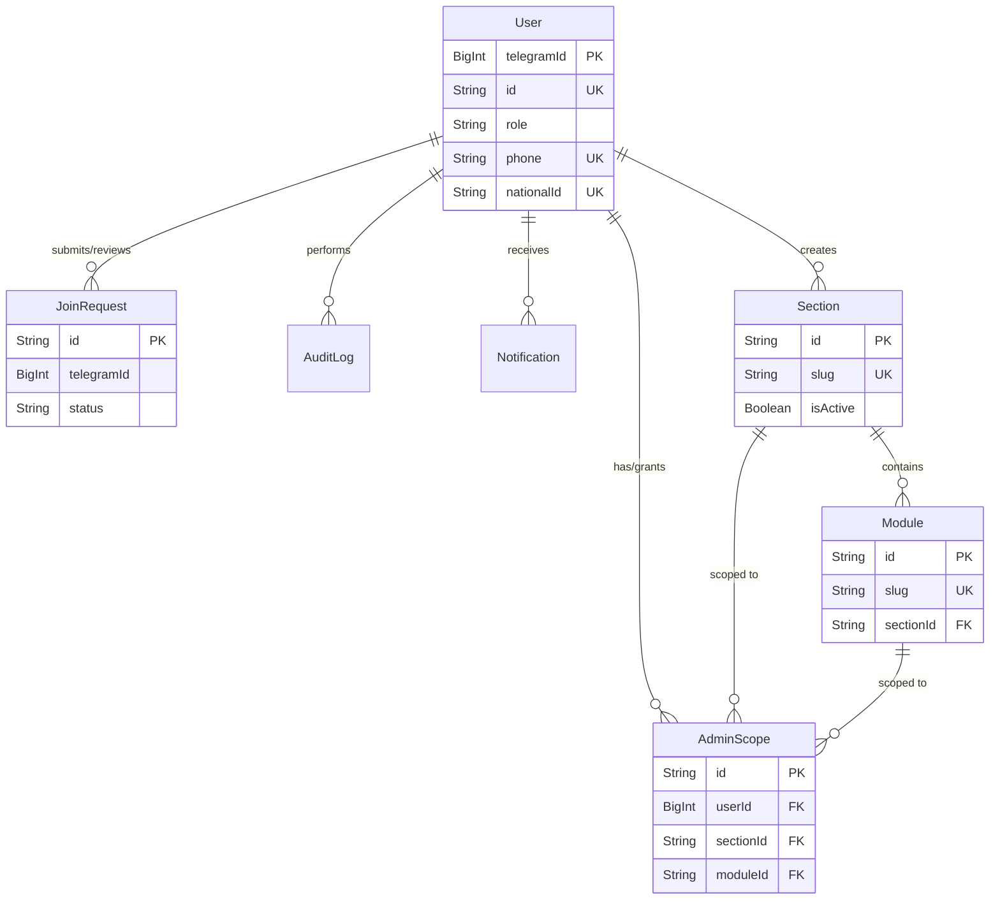

# Database Schema Reference

**Last Updated:** 2026-03-03

This document details the exact structure of the Al-Saada Smart Bot PostgreSQL database, sourced from the `prisma/schema` directory. It uses Prisma Client and the `prismaSchemaFolder` preview feature for organization.

---

## Entity Relationship Diagram

---

## 1. Global Enums (`main.prisma`)

### `Role`
| Value | Description |
| :--- | :--- |
| `SUPER_ADMIN` | Full system access. |
| `ADMIN` | Section or Module restricted administrator. |
| `EMPLOYEE` | Standard internal employee. |
| `VISITOR` | Default starting role for new/unverified users. |

### `Status`
| Value | Description |
| :--- | :--- |
| `PENDING` | Awaiting review. |
| `APPROVED` | Approved state. |
| `REJECTED` | Rejected state. |

### `NotificationType`
| Value |
| :--- |
| `JOIN_REQUEST_NEW` |
| `JOIN_REQUEST_APPROVED` |
| `JOIN_REQUEST_REJECTED` |
| `USER_DEACTIVATED` |
| `MAINTENANCE_ON` |
| `MAINTENANCE_OFF` |
| `MODULE_OPERATION` |

### `AuditAction`
| Value | Value | Value |
| :--- | :--- | :--- |
| `USER_BOOTSTRAP` | `SECTION_CREATE` | `MAINTENANCE_ON` |
| `USER_LOGIN` | `SECTION_UPDATE` | `MAINTENANCE_OFF` |
| `USER_LOGOUT` | `SECTION_DELETE` | `PERMISSION_CHANGE` |
| `ROLE_CHANGE` | `SECTION_ENABLE` | `ADMIN_SCOPE_ASSIGN` |
| `USER_APPROVE` | `SECTION_DISABLE` | `ADMIN_SCOPE_REVOKE` |
| `USER_REJECT` | `MODULE_REGISTER` | `BACKUP_TRIGGER` |
| `USER_ACTIVATE` | `MODULE_UNREGISTER` | `BACKUP_RESTORE` |
| `USER_DEACTIVATE` | `MODULE_ENABLE` | `MODULE_CREATE` |
| `JOIN_REQUEST_SUBMIT` | `MODULE_DISABLE` | `MODULE_UPDATE` \| `MODULE_DELETE` |

---

## 2. Core Models (`platform.prisma`)

### `User` (Table: `users`)
Represents telegram bot users and their authentication state.

#### Fields
| Field | Type | Attributes | Description |
| :--- | :--- | :--- | :--- |
| `telegramId` | `BigInt` | `@id`, `@map("telegram_id")` | Primary Key, Telegram numeric ID |
| `id` | `String` | `@unique`, `@default(cuid())` | Unique internal UUID/CUID |
| `fullName` | `String` | `@map("full_name")` | Full user name |
| `nickname` | `String?` | | Optional short display name |
| `phone` | `String?` | `@unique` | Optional unique phone number |
| `nationalId` | `String?` | `@unique`, `@map("national_id")` | Optional unique National ID |
| `telegramUsername` | `String?` | `@map("telegram_username")` | Telegram @handle |
| `role` | `Role` | `@default(VISITOR)` | Access control role |
| `isActive` | `Boolean` | `@default(true)`, `@map("is_active")` | Account enabled status |
| `language` | `String` | `@default("ar")` | Preferred language code |
| `lastActiveAt` | `DateTime?` | `@map("last_active_at")` | Last interaction timestamp |
| `createdAt` | `DateTime` | `@default(now())`, `@map("created_at")` | Creation timestamp |
| `updatedAt` | `DateTime` | `@updatedAt`, `@map("updated_at")` | Last update timestamp |

#### Relationships
- `JoinRequest` (`joinRequests` via `User.telegramId`, `reviewedJoinRequests` via `User.telegramId` as reviewer)
- `AuditLog` (`auditLogs` via `User.telegramId`)
- `Notification` (`notifications` via `User.telegramId`)
- `AdminScope` (`adminScopes` via `User.telegramId` as user, `createdAdminScopes` as creator)
- `Section` (`createdSections` via `User.telegramId` as creator)

---

### `JoinRequest` (Table: `join_requests`)
Holds pending registration requests for `VISITOR`s attempting to upgrade their role.

#### Fields
| Field | Type | Attributes | Description |
| :--- | :--- | :--- | :--- |
| `id` | `String` | `@id`, `@default(cuid())` | Primary Key |
| `telegramId` | `BigInt` | `@map("telegram_id")` | Submitter Telegram ID |
| `fullName` | `String` | `@map("full_name")` | Requested Name |
| `nickname` | `String?` | | Requested Nickname |
| `phone` | `String` | | Required Phone |
| `nationalId` | `String` | `@map("national_id")` | Required National ID |
| `status` | `Status` | `@default(PENDING)` | Request status |
| `reviewedBy` | `BigInt?` | `@map("reviewed_by")` | Reviewing ADMIN Telegram ID |
| `reviewedAt` | `DateTime?` | `@map("reviewed_at")` | Review timestamp |
| `createdAt` | `DateTime` | `@default(now())`, `@map("created_at")` | Submission timestamp |

#### Relationships
- `User` (`user` via `telegramId` to `User.telegramId`)
- `User` (`reviewer` via `reviewedBy` to `User.telegramId` marked `ReviewAdmin`)

---

### `Section` (Table: `sections`)
Dynamic containers/departments holding multiple modules.

#### Indexes
- `@@index([isActive])`
- `@@index([orderIndex])`

#### Fields
| Field | Type | Attributes | Description |
| :--- | :--- | :--- | :--- |
| `id` | `String` | `@id`, `@default(cuid())` | Primary Key |
| `slug` | `String` | `@unique` | Internal text identifier |
| `name` | `String` | | Arabic section name |
| `nameEn` | `String` | | English section name |
| `icon` | `String` | | Emoji representation |
| `isActive` | `Boolean` | `@default(true)`, `@map("is_active")` | Viewable status |
| `orderIndex` | `Int` | `@default(0)`, `@map("order_index")` | Positioning in lists |
| `createdAt` | `DateTime` | `@default(now())`, `@map("created_at")` | Creation timestamp |
| `updatedAt` | `DateTime` | `@updatedAt`, `@map("updated_at")` | Last update timestamp |
| `createdBy` | `BigInt?` | `@map("created_by")` | Creator Telegram ID |

#### Relationships
- `User` (`creator` via `createdBy` to `User.telegramId`)
- `Module` (`modules` via `Section.id`)
- `AdminScope` (`adminScopes` via `Section.id`)

---

### `Module` (Table: `modules`)
Configurations of dynamically discovered feature extensions.

#### Indexes
- `@@index([sectionId])`
- `@@index([isActive])`
- `@@index([orderIndex])`

#### Fields
| Field | Type | Attributes | Description |
| :--- | :--- | :--- | :--- |
| `id` | `String` | `@id`, `@default(cuid())` | Primary Key |
| `slug` | `String` | `@unique` | Directory matched slug |
| `name` | `String` | | Arabic module name |
| `nameEn` | `String` | | English module name |
| `sectionId` | `String` | `@map("section_id")` | Parent section |
| `icon` | `String` | | Emoji representation |
| `isActive` | `Boolean` | `@default(true)`, `@map("is_active")` | Availability tag |
| `orderIndex` | `Int` | `@default(0)`, `@map("order_index")` | Parent section sorting index |
| `configPath` | `String` | `@map("config_path")` | Path to `config.ts` |
| `createdAt` | `DateTime` | `@default(now())`, `@map("created_at")` | Creation timestamp |

#### Relationships
- `Section` (`section` via `sectionId` to `Section.id`)
- `AdminScope` (`adminScopes` via `Module.id`)

---

### `AuditLog` (Table: `audit_logs`)
System immutable audit trail records with JSON context payload.

#### Indexes
- `@@index([userId])`
- `@@index([action])`
- `@@index([createdAt])`

#### Fields
| Field | Type | Attributes | Description |
| :--- | :--- | :--- | :--- |
| `id` | `String` | `@id`, `@default(cuid())` | Primary Key |
| `userId` | `BigInt` | `@map("user_id")` | Performer Telegram ID |
| `action` | `AuditAction` | | Action performed |
| `targetType` | `String?` | `@map("target_type")` | Context target entity (e.g. `User`) |
| `targetId` | `String?` | `@map("target_id")` | Context target ID |
| `details` | `Json?` | | Extended context/diffs |
| `createdAt` | `DateTime` | `@default(now())`, `@map("created_at")` | Execution timestamp |

#### Relationships
- `User` (`user` via `userId` to `User.telegramId`)

---

### `Notification` (Table: `notifications`)
Queued tasks waiting transmission delivery to Telegram endpoints.

#### Indexes
- `@@index([targetUserId])`
- `@@index([type])`
- `@@index([isRead])`
- `@@index([createdAt])`

#### Fields
| Field | Type | Attributes | Description |
| :--- | :--- | :--- | :--- |
| `id` | `String` | `@id`, `@default(cuid())` | Primary Key |
| `targetUserId` | `BigInt` | `@map("target_user_id")` | Intended Recipient ID |
| `type` | `NotificationType`| | Delivery template binding |
| `params` | `Json?` | | Values to hydrate template variables |
| `isRead` | `Boolean` | `@default(false)`, `@map("is_read")` | Dispatched/Read status |
| `createdAt` | `DateTime` | `@default(now())`, `@map("created_at")` | Enqueue timestamp |

#### Relationships
- `User` (`user` via `targetUserId` to `User.telegramId`)

---

### `AdminScope` (Table: `admin_scopes`)
Granular permission overrides mapping `ADMIN` users to specific Sections or independent Modules.

#### Indexes
- `@@unique([userId, sectionId, moduleId])`
- `@@index([userId])`
- `@@index([sectionId])`

#### Fields
| Field | Type | Attributes | Description |
| :--- | :--- | :--- | :--- |
| `id` | `String` | `@id`, `@default(cuid())` | Primary Key |
| `userId` | `BigInt` | `@map("user_id")` | ADMIN user Telegram ID |
| `sectionId` | `String` | `@map("section_id")` | Authorized Section |
| `moduleId` | `String?` | `@map("module_id")` | Specialized Module limit |
| `createdAt` | `DateTime` | `@default(now())`, `@map("created_at")` | Creation timestamp |
| `createdBy` | `BigInt` | `@map("created_by")` | Assigning Administrator |

#### Relationships
- `User` (`user` via `userId` to `User.telegramId` marked `AdminScopeUser`)
- `Section` (`section` via `sectionId` to `Section.id`)
- `Module` (`module` via `moduleId` to `Module.id`)
- `User` (`creator` via `createdBy` to `User.telegramId` marked `AdminScopeCreator`)
