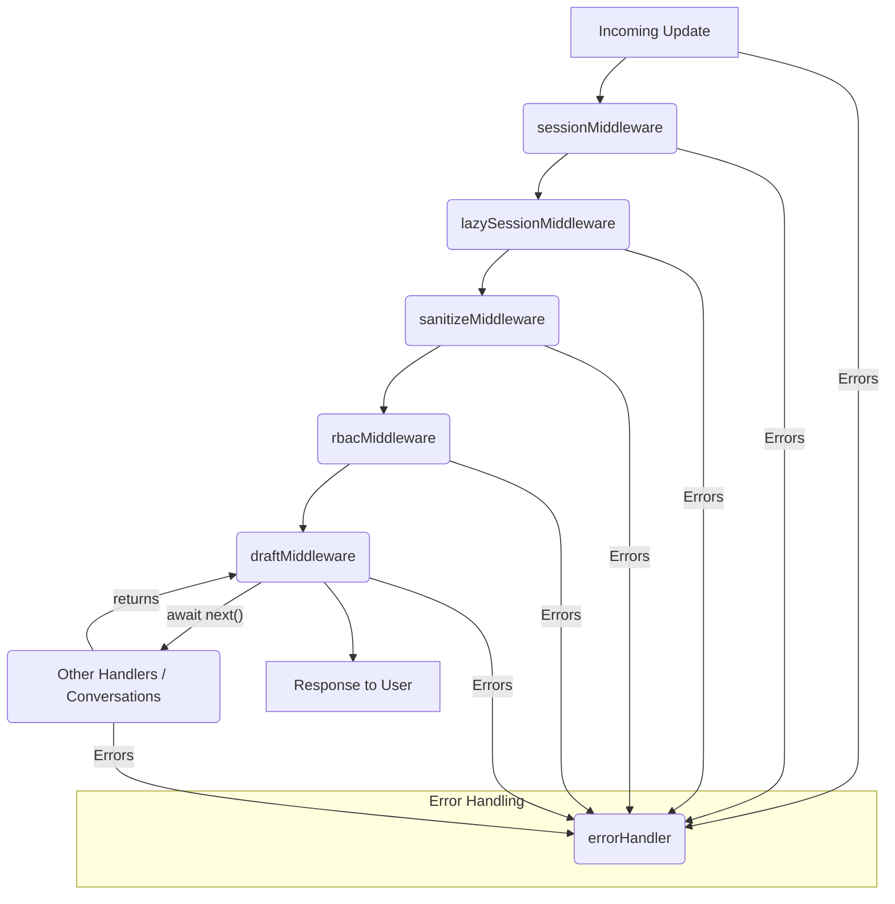

# Bot Middleware & Session

This document provides a comprehensive overview of the **Bot Middleware & Session** module, which forms the backbone of how the Telegram bot processes incoming updates, manages user state, enforces security, and handles ongoing conversations.

## Introduction

In the `grammy` framework, middleware functions are the core mechanism for processing incoming updates. They form a chain, with each middleware having the opportunity to process an update, modify the `Context` object (`ctx`), and decide whether to pass control to the next middleware in the chain using `next()`.

The **Bot Middleware & Session** module centralizes critical cross-cutting concerns:

*   **Session Management**: Persisting user-specific data across multiple interactions.
*   **Security**: Enforcing access control (RBAC) and sanitizing user input.
*   **Conversation State**: Managing and auto-saving the state of multi-step user conversations.
*   **Error Handling**: Providing a robust mechanism to catch and log errors.

This module ensures that every interaction with the bot is handled securely, statefully, and gracefully.

## Core Concepts

### `BotContext`

The `BotContext` object is the central data carrier for every update processed by the bot. It extends `grammy`'s default `Context` with custom properties, most notably `ctx.session` for persistent user data and `ctx.t()` for internationalization. Middleware functions primarily interact with and modify this `ctx` object.

### Session Data (`SessionData`)

`ctx.session` is a key component, providing a mutable, persistent store for user-specific data. The `SessionData` type defines its structure:

```typescript
interface SessionData {
  userId?: number // Telegram user ID
  role: 'VISITOR' | 'USER' | 'ADMIN' | 'SUPER_ADMIN' // User's role
  language: string // User's preferred language
  __language_code: string // Internal i18n language code
  currentSection: string | null // Active section for the user
  currentModule: string | null // Active module/conversation for the user
  lastActivity: number // Timestamp of last interaction
  // ... other module-specific conversation data
}
```

This data is automatically loaded at the start of an update and saved at the end, thanks to the session middleware.

### Middleware Chain

Middleware functions are executed sequentially. Each middleware receives `ctx` and a `next` function. Calling `await next()` passes control to the next middleware. If `next()` is not called, the chain is halted, and no subsequent middleware (or handlers) will execute for that update.

A simplified representation of the core middleware chain:



## Key Middleware Components

### 1. Session Management

This set of components is responsible for initializing, reading, writing, and deleting user session data, primarily backed by Redis.

#### `defaultSession()`

This function provides the initial state for a new user session. It ensures that every new session starts with a defined structure, including a default `VISITOR` role and `ar` (Arabic) language.

```typescript
export function defaultSession(): SessionData {
  return {
    userId: undefined,
    role: 'VISITOR',
    language: 'ar',
    __language_code: 'ar',
    currentSection: null,
    currentModule: null,
    lastActivity: Date.now(),
  }
}
```

#### `redisStorage`

This object implements `grammy`'s `StorageAdapter` interface, allowing `grammy` to use Redis for session persistence.

*   **`read(key: string)`**: Fetches session data from Redis using the provided key (e.g., `session:12345`). Data is stored as a JSON string and parsed back into `SessionData`.
*   **`write(key: string, value: SessionData)`**: Serializes `SessionData` to JSON and stores it in Redis with a 24-hour TTL (`86400` seconds) using `redis.setex()`.
*   **`delete(key: string)`**: Removes session data from Redis using `redis.del()`.

Error logging is included for all Redis operations to ensure visibility into storage issues.

#### `sessionMiddleware`

This is the primary `grammy` session plugin. It's configured with:

*   `initial: defaultSession`: Specifies the function to call when a new session needs to be created.
*   `storage: redisStorage`: Instructs `grammy` to use our custom Redis adapter for all session read/write operations.

This middleware automatically handles loading `ctx.session` at the start of an update and saving it at the end.

#### `lazySessionMiddleware`

This middleware addresses a specific scenario (FR-026 + T066-B): when a user interacts with the bot, but their session has expired (e.g., after 24 hours of inactivity).

*   **Purpose**: Detects re-engaging known users whose sessions have expired and logs appropriate audit events.
*   **Mechanism**:
    1.  Checks if `ctx.from?.id` exists (it's a user interaction) and `ctx.session.userId` is *not* set (indicating an expired or missing session).
    2.  Queries `prisma.user` to see if the `telegramId` is known in the database.
    3.  If the user is found, it infers a `USER_LOGOUT` (due to session expiry) and a subsequent `USER_LOGIN` event. These events are logged via `auditService.log()`.
    4.  Updates `ctx.session.userId` with the `ctx.from.id` to re-establish the user's identity in the session.

This ensures that even after a session expires, the system can correctly attribute activity and maintain an audit trail.

### 2. Security & Access Control

These middlewares protect the bot from malicious input and unauthorized access.

#### `sanitizeMiddleware`

*   **Purpose**: Prevents Cross-Site Scripting (XSS) vulnerabilities by sanitizing all incoming text messages (FR-033).
*   **Mechanism**: If `ctx.message?.text` exists, it's passed through the `sanitizeHtml` function from `@al-saada/validators`. This function removes or escapes potentially harmful HTML tags and attributes.
*   **Dependency**: `@al-saada/validators`.

#### `rbacMiddleware`

This middleware (T111, T029) enforces user activity status and role-based access control for commands.

*   **Purpose**:
    1.  Ensure only active users can interact with the bot.
    2.  Restrict access to sensitive commands based on the user's `Role`.
*   **Mechanism**:
    1.  **Active Check (T111)**: Fetches the user from `prisma.user` based on `telegramId`. If the user exists but `user.isActive` is `false`, the session is cleared (`ctx.session = defaultSession()`), an error message is sent, and the middleware chain is halted. This prevents inactive users from proceeding.
    2.  **Role Sync**: If the user's role in the database (`user.role`) differs from `ctx.session.role`, the session is updated to reflect the database's role.
    3.  **Route Protection (T029)**:
        *   Identifies the command from `ctx.message?.text`.
        *   Checks `superAdminOnly` commands (e.g., `/users`, `/audit`). If the `currentRole` is not `SUPER_ADMIN`, access is denied, an error message is sent, and the chain is halted.
        *   Checks `adminOnly` commands (e.g., `/sections`). For these, it calls `rbacService.canAccess(telegramId, currentRole, { /* scope */ })`. If `canAccess` returns `false`, access is denied, and the chain is halted.
*   **Dependencies**: `prisma`, `rbacService`.

### 3. Conversation & Draft Management

#### `draftMiddleware`

This middleware (Layer 2) is crucial for managing multi-step module conversations, handling interruptions, and providing "resume" functionality (US3). It wraps the `next()` call to perform actions both before and after the main conversation handler.

*   **Purpose**:
    1.  Intercept all inputs during an active module conversation.
    2.  Handle common command interrupts gracefully.
    3.  Auto-save conversation state to Redis for recovery.
*   **Mechanism (Pre-`next()` - Interrupts)**:
    1.  Only activates if `ctx.session.currentModule` is set, indicating an active conversation.
    2.  **Command Detection**:
        *   If the user sends `/cancel`, `/start`, or `/menu`:
            *   Logs the interruption.
            *   Clears `ctx.session.currentModule` to exit the conversation context.
            *   Replies with a cancellation message for `/cancel`.
            *   Crucially, it calls `return next()`, allowing the respective command handlers (e.g., for `/start`, `/menu`) to execute.
        *   If the user sends `/help`:
            *   Determines the appropriate help message by trying module-specific step help (`${moduleSlug}-help-${step}`), then default module help, then system default.
            *   Replies with the help message.
            *   **Does NOT call `next()`**: This keeps the user in the current conversation step, allowing them to continue after receiving help.
*   **Mechanism (Post-`next()` - Auto-save)**:
    1.  After `await next()` has completed (meaning the `@grammyjs/conversations` plugin has processed the update and potentially updated its state), `draftMiddleware` re-checks `ctx.session.currentModule`.
    2.  If `currentModule` is still active, it retrieves the module's configured `draftTtlHours` using `moduleLoader.getModule()`.
    3.  It captures the entire `ctx.session` object, including `currentModule`, `currentSection`, and any module-specific data.
    4.  It also specifically extracts the conversation state managed by `@grammyjs/conversations`, which is typically stored in `(ctx.session as any).conversations`.
    5.  This combined state (`data: ctx.session`, `conversations: conversationState`, `updatedAt: Date.now()`) is then serialized to JSON and saved to Redis with a key like `draft:${userId}:${moduleSlug}` and the calculated TTL.
*   **Dependencies**: `redis`, `moduleLoader`, `logger`, and implicitly relies on `@grammyjs/conversations` for managing `ctx.session.conversations`.

### 4. Error Handling

#### `errorHandler`

This function serves as the global error handler for the `grammy` bot.

*   **Purpose**: Catch and gracefully handle any unhandled errors that occur during the processing of an update.
*   **Mechanism**:
    1.  Receives a `BotError<BotContext>` object.
    2.  Logs detailed error information (the error itself, `userId`, `chatId`, `update_id`) using `logger.error()`.
    3.  Attempts to send a user-friendly, generic error message (`ctx.t('error-generic')`) to the user.
    4.  Includes a fallback `try-catch` for sending the error message, logging if even that fails.
*   **Dependency**: `logger`.

## Integration Points

This module integrates with several other parts of the codebase and external services:

*   **`redis`**: Used by `redisStorage` for session persistence and by `draftMiddleware` for conversation draft auto-saving.
*   **`prisma`**: The ORM used by `rbacMiddleware` to fetch user activity status and roles, and by `lazySessionMiddleware` to identify known users.
*   **`moduleLoader`**: Used by `draftMiddleware` to retrieve module-specific configuration, such as `draftTtlHours`.
*   **`rbacService`**: Used by `rbacMiddleware` to perform detailed access checks for scoped commands.
*   **`auditService`**: Used by `lazySessionMiddleware` to log `USER_LOGIN` and `USER_LOGOUT` events.
*   **`@al-saada/validators`**: Provides the `sanitizeHtml` function used by `sanitizeMiddleware`.
*   **`grammy`**: The core bot framework, providing the `Middleware` and `StorageAdapter` interfaces.
*   **`@grammyjs/conversations`**: While not directly imported, `draftMiddleware` interacts with the state managed by this plugin (specifically `ctx.session.conversations`).

## Contributing and Extending

When working with this module:

*   **Adding New Middleware**: New middleware functions should follow the `(ctx, next) => {}` signature. Consider their position in the middleware chain; security and session-related middlewares typically run earlier, while business logic and conversation handlers run later.
*   **Modifying Existing Middleware**: Be mindful of side effects on `ctx.session` or `ctx.message`. Changes to `rbacMiddleware` or `sanitizeMiddleware` have significant security implications.
*   **Session Data**: If new data needs to be stored in the session, update the `SessionData` interface in `packages/core/src/types/context.ts` and consider how `defaultSession()` should initialize it.
*   **Testing**: Each middleware has dedicated unit tests (e.g., `rbac.test.ts`, `sanitize.test.ts`). Ensure any changes are covered by existing tests or new tests are added.
