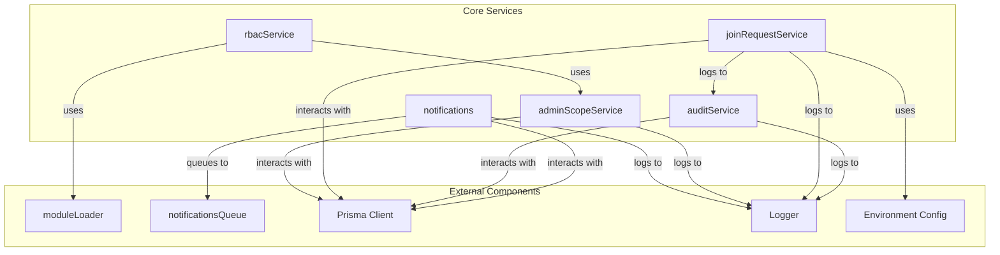

# Core Services

The `packages/core/src/services` directory houses the **Core Services** module, a collection of essential business logic and data interaction layers for the application. These services provide foundational functionalities such as user access control, administrative scope management, system-wide auditing, user onboarding, and notification handling. They are designed to be reusable and encapsulate specific domain logic, interacting primarily with the database via Prisma and other core utilities.

## Core Concepts

Before diving into individual services, understanding a few core concepts is crucial:

*   **Scopes**: Granular permissions assigned to `ADMIN` users, defining their access to specific `section`s or `module`s within the application.
*   **Audit Logs**: Immutable records of significant system events and user actions, crucial for security, compliance (FR-026), and debugging. Sensitive data is redacted (FR-027).
*   **Join Requests**: The initial mechanism for new users to request access to the system. This process also includes a special "bootstrap" flow for the very first Super Admin (FR-014).
*   **RBAC (Role-Based Access Control)**: A system that restricts access to resources based on the roles assigned to users (e.g., `SUPER_ADMIN`, `ADMIN`, `EMPLOYEE`, `VISITOR`).

## Services Overview

### 1. Admin Scope Service (`admin-scope.ts`)

The `adminScopeService` manages the assignment and revocation of administrative scopes for users with the `ADMIN` role. These scopes define which sections or modules an administrator has permissions over.

**Purpose:** To provide a programmatic interface for managing `AdminScope` records, which are critical for the `rbacService` to determine an `ADMIN` user's permissions.

**Key Functions:**

*   `getScopes(userId: bigint)`: Retrieves all `AdminScope` entries for a given user, including details about the associated `section` and `module`.
*   `assignScope(params: { userId: bigint; sectionId: string; moduleId?: string; createdBy: bigint })`: Assigns a new scope to an admin user. It uses `upsert` to ensure idempotency, creating the scope if it doesn't exist or doing nothing if it does.
*   `revokeScope(params: { userId: bigint; sectionId: string; moduleId?: string })`: Removes an existing scope from an admin user.

**Usage:**
This service is primarily consumed by the `rbacService` to evaluate `ADMIN` user permissions and by administrative handlers (e.g., `userActionsHandler`) for managing user access.

**Example:**
```typescript
import { adminScopeService } from './admin-scope'

// Assign a user full access to the 'users' section
await adminScopeService.assignScope({
  userId: 123n,
  sectionId: 'users',
  moduleId: null, // null moduleId means section-wide access
  createdBy: 456n,
})

// Get all scopes for a user
const scopes = await adminScopeService.getScopes(123n)
console.log(scopes)
```

### 2. Audit Logs Service (`audit-logs.ts`)

The `auditService` is responsible for logging significant actions and events across the system. It implements specific functional requirements for audit logging and data redaction.

**Purpose:** To maintain a comprehensive, immutable record of system activities for security, compliance (FR-026), and debugging purposes. It ensures sensitive data is not stored in plain text within logs (FR-027).

**Key Functions:**

*   `log(data: AuditLogData): Promise<void>`: Records an action in the `AuditLog` table.
    *   `AuditLogData` includes `userId`, `action` (from `AuditAction` enum), optional `targetType`, `targetId`, and `details`.
    *   **Redaction Logic**: Before saving, the `details` object is scanned for sensitive fields (`nationalId`, `phone`, `password`, `token`, `apiKey`). If found, their values are replaced with `[REDACTED]`.
    *   **Error Handling**: Audit logging failures are caught internally, logged via `logger.error`, and fail silently to the caller to avoid disrupting primary operations.

**Usage:**
Any part of the application performing a critical action (e.g., user creation, role change, sensitive data modification, system bootstrap) should use this service to record the event.

**Example:**
```typescript
import { AuditAction } from '@prisma/client'
import { AuditLogData, auditService } from './audit-logs'

const logData: AuditLogData = {
  userId: 123n,
  action: AuditAction.USER_LOGIN,
  targetType: 'User',
  targetId: 'user-abc-123',
  details: {
    ipAddress: '192.168.1.1',
    // Example of sensitive data that would be redacted
    password: 'mySecretPassword123',
  },
}
await auditService.log(logData)
```

### 3. Join Requests Service (`join-requests.ts`)

The `joinRequestService` handles the initial onboarding process for new users, including the special case of bootstrapping the first Super Admin.

**Purpose:** To manage user join requests, allowing new users to register their interest in joining the system. Crucially, it also implements the "Super Admin Bootstrap" mechanism (FR-014) for initial system setup.

**Key Functions:**

*   `hasPendingRequest(telegramId: bigint)`: Checks if a user identified by their `telegramId` already has an active `PENDING` join request.
*   `create(params: CreateJoinRequestParams)`: Creates a new `PENDING` join request record in the database.
*   `createOrBootstrap(params: CreateJoinRequestParams)`: This is the core function for initial user entry.
    *   It first checks if the system has any `SUPER_ADMIN` users.
    *   If no `SUPER_ADMIN`s exist AND the provided `telegramId` matches the `INITIAL_SUPER_ADMIN_ID` environment variable, it directly creates a `SUPER_ADMIN` user and logs an `AuditAction.USER_BOOTSTRAP` event.
    *   Otherwise, it creates a standard `PENDING` join request.
    *   Returns `{ type: 'bootstrap' }` or `{ type: 'join-request', requestId: string }`.

**Usage:**
Primarily used by the `joinConversation` in the bot to handle new user registrations.

**Example:**
```typescript
import { joinRequestService } from './join-requests'

const joinParams = {
  telegramId: 987654321n,
  fullName: 'Jane Doe',
  phone: '+1234567890',
  nationalId: '1234567890123',
}

const result = await joinRequestService.createOrBootstrap(joinParams)

if (result.type === 'bootstrap') {
  console.log('Super Admin user bootstrapped successfully!')
}
else {
  console.log(`Join request created with ID: ${result.requestId}`)
}
```

### 4. Notifications Service (`notifications.ts`)

This module provides functions to queue notifications for users, leveraging a database for persistence and BullMQ for asynchronous processing.

**Purpose:** To standardize and centralize the process of sending notifications to users, ensuring they are persisted and processed reliably in the background.

**Key Functions:**

*   `queueNotification(data: NotificationJobData): Promise<string>`: Queues a single notification.
    1.  Saves the notification record to the `Notification` table in the database.
    2.  Adds a job to the `notificationsQueue` (BullMQ), using the database record's ID as the job ID for traceability.
    3.  Logs the action, redacting any sensitive `params` content.
    4.  Returns the ID of the created notification record.
*   `queueBulkNotifications(items: NotificationJobData[]): Promise<string[]>`: Queues multiple notifications efficiently.
    1.  Uses a Prisma transaction to create all notification records in the database.
    2.  Adds all corresponding jobs to the `notificationsQueue` in a single batch using `addBulk`.
    3.  Logs a summary of the bulk action.
    4.  Returns an array of IDs for the created notification records.

**Usage:**
Used by various parts of the application (e.g., `notifyScopedAdmins`, `approvalsHandler`, `notifyAdmins`) whenever a user needs to be informed of an event.

**Example:**
```typescript
import { NotificationType } from '../types/notification'
import { queueBulkNotifications, queueNotification } from './notifications'

// Queue a single notification
await queueNotification({
  targetUserId: 123n,
  type: NotificationType.JOIN_REQUEST_APPROVED,
  params: { requestId: 'req-abc-123' },
})

// Queue multiple notifications
await queueBulkNotifications([
  { targetUserId: 456n, type: NotificationType.REMINDER, params: { message: 'Meeting at 3 PM' } },
  { targetUserId: 789n, type: NotificationType.REMINDER, params: { message: 'Review pending tasks' } },
])
```

### 5. RBAC Service (`rbac.ts`)

The `rbacService` implements the core Role-Based Access Control logic, determining if a user has permission to access a resource or perform a specific action.

**Purpose:** To enforce authorization rules across the application, ensuring users can only interact with resources and perform actions permitted by their assigned role and, for `ADMIN`s, their specific scopes.

**Key Functions:**

*   `canAccess(userId: bigint, role: Role, options?: AccessOptions): Promise<boolean>`: Checks if a user with a given `role` can access a general resource (e.g., a section or module).
    *   `SUPER_ADMIN`s always have full access.
    *   `ADMIN`s' access is determined by querying `adminScopeService.getScopes` and matching against the requested `sectionId` and `moduleId`.
    *   `EMPLOYEE` and `VISITOR` roles have restricted access, typically `false` for administrative access checks.
*   `canPerformAction(userId: bigint, role: Role, moduleSlug: string, action: 'view' | 'create' | 'edit' | 'delete'): Promise<boolean>`: Checks if a user can perform a specific action within a particular module.
    *   Loads module configuration via `moduleLoader.getModule`.
    *   Checks if the user's `role` is listed in the module's `permissions` for the given `action`.
    *   For `ADMIN`s, it further verifies that the user has an `AdminScope` for the relevant section or module.

**Usage:**
This service is critical for authorization middleware (e.g., `rbacMiddleware`) and any part of the application that needs to gate access to features or data based on user permissions.

**Example:**
```typescript
import { Role } from '@prisma/client'
import { AccessOptions, rbacService } from './rbac'

// Check if a SUPER_ADMIN can access the 'settings' section
const canSuperAdminAccess = await rbacService.canAccess(1n, Role.SUPER_ADMIN, { sectionId: 'settings' }) // true

// Check if an ADMIN can access a specific module within a section
const canAdminAccessModule = await rbacService.canAccess(123n, Role.ADMIN, {
  sectionId: 'users',
  moduleId: 'user-management',
}) // true if scope exists

// Check if an EMPLOYEE can create a new record in the 'reports' module
const canEmployeeCreate = await rbacService.canPerformAction(
  456n,
  Role.EMPLOYEE,
  'reports',
  'create'
) // false, unless module config explicitly allows
```

## Service Interactions and Data Flow

The Core Services module is designed with clear responsibilities, but services often depend on each other to fulfill complex workflows.



**Key Interactions:**

*   **RBAC and Admin Scopes**: `rbacService` relies heavily on `adminScopeService.getScopes` to determine access for `ADMIN` users. This forms the core of granular administrative permissions.
*   **RBAC and Module Configuration**: `rbacService.canPerformAction` dynamically loads module configurations via `moduleLoader.getModule` to check action-specific permissions.
*   **Join Requests and Auditing**: When a `SUPER_ADMIN` is bootstrapped via `joinRequestService.createOrBootstrap`, an audit log entry is created using `auditService.log`.
*   **Notifications and Queuing**: The `notifications` functions (`queueNotification`, `queueBulkNotifications`) persist notification data to the database and then delegate the actual sending process to the `notificationsQueue` (BullMQ).
*   **Database and Logging**: All services interact with the `prisma` client for data persistence and use the `logger` utility for operational insights and debugging.

## Contribution Guidelines

When contributing to the Core Services module:

*   **Single Responsibility Principle**: Each service should ideally focus on a single, well-defined area of responsibility.
*   **Database Interactions**: All direct database operations should use the `prisma` client. Avoid raw SQL unless absolutely necessary and justified.
*   **Error Handling**: Implement robust error handling. For critical user-facing operations, consider graceful degradation. For background tasks (like audit logging), silent failure with logging might be appropriate.
*   **Logging**: Use the provided `logger` for all informational, warning, and error messages. Be mindful of logging sensitive data; ensure redaction or avoidance where appropriate.
*   **Dependencies**: Minimize external dependencies. Prefer internal service calls where existing logic can be reused.
*   **Testing**: Ensure comprehensive unit and integration tests are written for any new or modified service logic. Refer to existing tests like `unit/services/join-requests.test.ts` and `bot/middlewares/rbac.test.ts`.
