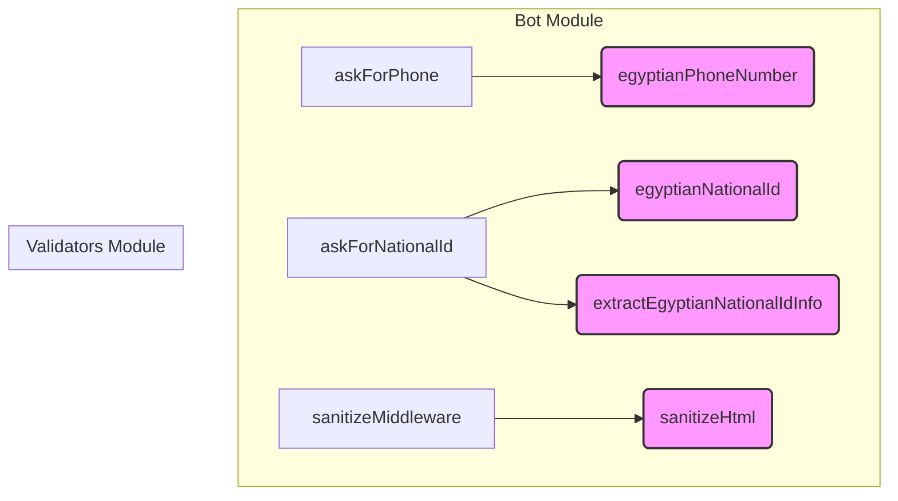

# Input Validation & Sanitization

This document provides comprehensive documentation for the `packages/validators` module, covering its purpose, key components, API, and integration points within the codebase.

## Input Validation & Sanitization Module

The `packages/validators` module is a core utility package responsible for ensuring data integrity and security by providing robust input validation and sanitization functionalities. It leverages the `zod` library for schema-based validation, offering both basic and highly specific validators for common data types, particularly those relevant to Egyptian contexts (e.g., phone numbers, national IDs). Additionally, it includes a utility for sanitizing HTML content to mitigate XSS vulnerabilities.

### Purpose

The primary goals of this module are:

1.  **Data Integrity**: Ensure that user inputs conform to expected formats and business rules before processing.
2.  **Security**: Prevent common web vulnerabilities like Cross-Site Scripting (XSS) by sanitizing user-provided content.
3.  **Reusability**: Provide a centralized, consistent set of validation and sanitization tools for various parts of the application.
4.  **Developer Experience**: Offer clear, declarative validation schemas using Zod, making it easy to define and apply validation rules.

### Key Components

The module is structured into several files, each focusing on a specific aspect of validation or sanitization:

*   **`phone.ts`**: Contains logic and Zod schemas for validating Egyptian phone numbers.
*   **`national-id.ts`**: Provides comprehensive validation and utility functions for Egyptian National IDs, including checksum verification and data extraction.
*   **`sanitize.ts`**: Offers a utility function for sanitizing HTML-sensitive characters in strings.
*   **`schemas.ts`**: Exports basic, regex-only Zod schemas for common data types, intended for simpler validation needs.

### Detailed API Reference

#### Egyptian Phone Number Validation (`phone.ts`)

This component provides a Zod schema for validating Egyptian phone numbers.

*   **`EGYPTIAN_PHONE_REGEX`**: A regular expression (`/^(010|011|012|015)\d{8}$/`) used to match the standard 11-digit Egyptian phone number format, starting with `010`, `011`, `012`, or `015`.
*   **`egyptianPhoneNumber()`**:
    *   **Returns**: A `z.ZodString` schema.
    *   **Description**: This function returns a Zod schema that preprocesses input by trimming whitespace and then validates it against `EGYPTIAN_PHONE_REGEX`.
    *   **Usage**:
        ```typescript
        import { egyptianPhoneNumber } from '@packages/validators';

        const phoneSchema = egyptianPhoneNumber();

        // Example usage
        phoneSchema.parse('01012345678'); // Valid
        phoneSchema.parse('  01198765432  '); // Valid, trims whitespace
        try {
          phoneSchema.parse('0101234567'); // Throws ZodError: Invalid Egyptian phone number format.
        } catch (e) {
          console.error(e.errors);
        }
        ```

#### Egyptian National ID Validation & Extraction (`national-id.ts`)

This component offers robust validation for Egyptian National IDs, including complex checks, and utilities to extract information.

*   **`EGYPTIAN_NATIONAL_ID_REGEX`**: A regular expression (`/^(2|3)\d{13}$/`) for the basic 14-digit format, ensuring it starts with `2` (1900s) or `3` (2000s).
*   **`VALID_GOVERNORATE_CODES`**: An array of valid two-digit governorate codes used in the ID.
*   **`isValidChecksum(id: string): boolean`**:
    *   **Description**: An internal helper function that validates the 14th digit of an Egyptian National ID using the Modulus 11 algorithm. This is a crucial part of the `egyptianNationalId` schema's refinement.
*   **`egyptianNationalId()`**:
    *   **Returns**: A `z.ZodString` schema.
    *   **Description**: This function returns a comprehensive Zod schema for Egyptian National IDs. It performs multiple validation steps:
        1.  **Preprocessing**: Trims whitespace.
        2.  **Format Regex**: Checks against `EGYPTIAN_NATIONAL_ID_REGEX`.
        3.  **Birth Date Refinement**: Extracts the birth year, month, and day from the ID and verifies it forms a valid date.
        4.  **Governorate Code Refinement**: Checks if the extracted governorate code is present in `VALID_GOVERNORATE_CODES`.
        5.  **Checksum Refinement**: Calls `isValidChecksum` to verify the ID's checksum digit.
    *   **Usage**:
        ```typescript
        import { egyptianNationalId } from '@packages/validators';

        const nationalIdSchema = egyptianNationalId();

        // Example usage
        nationalIdSchema.parse('29901010100001'); // Valid (example, actual valid IDs are complex)
        try {
          nationalIdSchema.parse('12345678901234'); // Throws ZodError: ID must be 14 digits and start with 2 or 3.
          nationalIdSchema.parse('29901010100000'); // Throws ZodError: Invalid checksum in National ID. (example)
        } catch (e) {
          console.error(e.errors);
        }
        ```
*   **`extractEgyptianNationalIdInfo(id: string): { birthDate: Date, gender: 'MALE' | 'FEMALE' }`**:
    *   **Parameters**: `id` (string) - A *validated* Egyptian National ID.
    *   **Returns**: An object containing the `birthDate` (as a `Date` object) and `gender` (`'MALE'` or `'FEMALE'`).
    *   **Description**: This utility function parses a *valid* Egyptian National ID to extract the birth date and gender. It assumes the ID has already passed validation via `egyptianNationalId()`.
    *   **Usage**:
        ```typescript
        import { extractEgyptianNationalIdInfo } from '@packages/validators';

        const validId = '29901010100001'; // Assume this is a valid ID
        const info = extractEgyptianNationalIdInfo(validId);
        console.log(info.birthDate); // Date object
        console.log(info.gender);    // 'MALE' or 'FEMALE'
        ```

#### HTML Sanitization (`sanitize.ts`)

This component provides a simple function to sanitize strings for safe display in HTML contexts.

*   **`sanitizeHtml(input: string): string`**:
    *   **Parameters**: `input` (string) - The raw string to sanitize.
    *   **Returns**: The sanitized string.
    *   **Description**: Replaces HTML-sensitive characters (`&`, `<`, `>`, `"`, `'`) with their corresponding HTML entities (`&amp;`, `&lt;`, `&gt;`, `&quot;`, `&#39;`). This helps prevent XSS attacks when user-provided content is rendered directly into HTML.
    *   **Usage**:
        ```typescript
        import { sanitizeHtml } from '@packages/validators';

        const userInput = '<script>alert("XSS")</script> & "hello"';
        const safeOutput = sanitizeHtml(userInput);
        console.log(safeOutput);
        // Output: &lt;script&gt;alert(&quot;XSS&quot;)&lt;/script&gt; &amp; &quot;hello&quot;
        ```

#### Basic Zod Schemas (`schemas.ts`)

This file provides simpler, regex-only Zod schemas for common data types. These are useful when a less strict or more performant validation is sufficient, or when the full complexity of the dedicated validators (like `egyptianNationalId`) is not required.

*   **`stringSchema`**: `z.string().trim()`
    *   A basic string schema that trims leading/trailing whitespace.
*   **`phoneSchema`**: `z.string().trim().regex(EGYPTIAN_PHONE_REGEX, { message: 'Invalid Egyptian phone number format.' })`
    *   A basic Egyptian phone number schema that only performs trimming and a regex check. It does *not* use the `egyptianPhoneNumber()` function, which might have additional logic in the future.
*   **`nationalIdSchema`**: `z.string().trim().regex(EGYPTIAN_NATIONAL_ID_REGEX, { message: 'ID must be 14 digits and start with 2 or 3.' })`
    *   A basic Egyptian National ID schema that only performs trimming and a regex check. It *does not* include the birth date, governorate, or checksum validations found in `egyptianNationalId()`.

### Integration with the System

The `packages/validators` module is a foundational utility used across different parts of the application, particularly within the bot module for handling user inputs.



*   **Bot User Input Utilities**:
    *   The `askForPhone` utility in `bot/utils/user-inputs.ts` utilizes `egyptianPhoneNumber()` to validate phone numbers provided by users.
    *   The `askForNationalId` utility in `bot/utils/user-inputs.ts` uses `egyptianNationalId()` for comprehensive validation of National IDs and `extractEgyptianNationalIdInfo()` to parse relevant data from a validated ID.
*   **Bot Middleware**:
    *   The `sanitizeMiddleware` in `bot/middlewares/sanitize.ts` employs `sanitizeHtml()` to clean incoming text messages or other user-generated content, ensuring that any data stored or displayed is free from malicious HTML.

### Contributing and Extending

Developers looking to contribute to or extend this module should consider the following:

*   **Adding New Validators**: For new complex data types requiring validation, create a new file (e.g., `email.ts`, `passport.ts`) and export a Zod schema function. Ensure it includes preprocessing (like trimming) and all necessary `refine` steps for comprehensive validation.
*   **Improving Existing Validators**: If a validation rule needs to be updated (e.g., a new phone prefix, a change in National ID structure), modify the relevant regex or `refine` logic within the existing functions.
*   **Adding New Sanitization**: For new types of sanitization (e.g., URL sanitization), create a new function in `sanitize.ts`.
*   **Testing**: All new or modified validators/sanitizers must be accompanied by comprehensive unit tests in their respective `tests/` directories to ensure correctness and prevent regressions.
*   **Zod Best Practices**: Adhere to Zod's best practices for schema definition, error messages, and transformations.
*   **Performance**: For highly performance-sensitive validations, consider the trade-offs between Zod's flexibility and raw regex performance. The `schemas.ts` file provides an example of simpler, regex-only schemas for such cases.