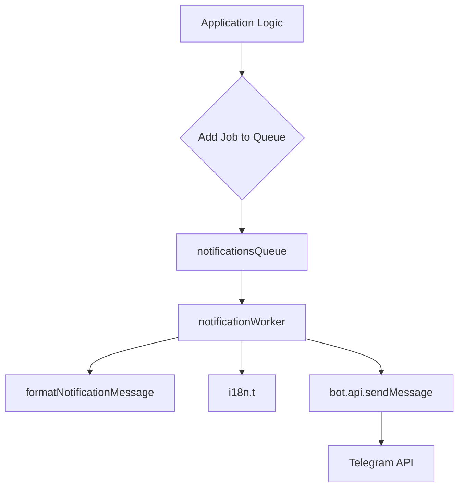

# Notification System

The Notification System module is responsible for asynchronously processing and delivering various types of notifications to users, primarily via the Telegram Bot API. It leverages a robust queueing system (BullMQ) to ensure reliable delivery, handle retries, and manage API rate limits.

## Purpose

The primary goal of this module is to:
*   Decouple notification generation from actual delivery, improving application responsiveness and resilience.
*   Ensure reliable delivery of notifications, with built-in retry mechanisms for transient failures.
*   Comply with external API rate limits (e.g., Telegram's flood control) to prevent service interruptions.
*   Provide internationalized messages for users.

## Architecture Overview

The notification system operates on a producer-consumer model using BullMQ, backed by Redis. When a notification needs to be sent, a "job" is added to the `notificationsQueue`. A dedicated `notificationWorker` then picks up these jobs, processes them, and sends the actual message via the Telegram Bot API.

## Key Components

### 1. Notification Queue (`notificationsQueue`)

*   **Location**: `packages/core/src/services/queue.ts`
*   **Instance**: `export const notificationsQueue = new Queue('notifications', ...)`
*   **Role**: This is the central queue where all notification jobs are enqueued. It acts as a buffer, holding pending notifications until the worker is ready to process them.
*   **Configuration**:
    *   Uses the shared `redis` connection.
    *   `defaultJobOptions`:
        *   `attempts: 3`: Jobs will be retried up to 3 times on failure.
        *   `backoff: { type: 'exponential', delay: 5000 }`: Retries will use an exponential backoff strategy, starting with a 5-second delay.
        *   `removeOnComplete: true`: Successfully completed jobs are automatically removed from the queue.
        *   `removeOnFail: false`: Failed jobs are kept in the queue for inspection (though they will be retried).
*   **Shutdown**: The `closeQueue()` function provides a graceful way to shut down the queue, ensuring no jobs are lost during application termination.

### 2. Notification Worker (`notificationWorker`)

*   **Location**: `packages/core/src/workers/notification.ts`
*   **Instance**: `export const notificationWorker = new Worker<NotificationJobData>('notifications', ...)`
*   **Role**: This worker is responsible for consuming jobs from the `notificationsQueue` and executing the actual notification delivery logic.
*   **Processing Logic**:
    *   It receives a `Job<NotificationJobData>` object.
    *   It extracts `targetUserId` and `params` from `job.data`.
    *   It determines the correct i18n message key using `formatNotificationMessage()`.
    *   It translates the message using `i18n.t()`.
    *   It sends the message using `bot.api.sendMessage(String(targetUserId), message)`.
    *   Logs success or failure of each delivery attempt.
*   **Rate Limiting**:
    *   `limiter: { max: 30, duration: 1000 }`: Implements a rate limit of 30 messages per 1000 milliseconds (1 second). This is crucial for complying with Telegram API flood control rules (FR-024) and preventing temporary bans.
*   **Error Handling**: If `bot.api.sendMessage` fails, the error is rethrown. BullMQ's queue configuration (specifically `attempts` and `backoff`) will then handle retries automatically.
*   **Shutdown**: The `closeWorker()` function ensures the worker gracefully stops processing new jobs and finishes any in-progress jobs before shutting down.

### 3. Message Formatting (`formatNotificationMessage`)

*   **Location**: `packages/core/src/workers/notification.ts`
*   **Function**: `function formatNotificationMessage(data: NotificationJobData): string`
*   **Role**: This helper function maps the `type` property from the `NotificationJobData` to a specific i18n key. This centralizes the logic for determining which localized message template to use for each notification type.
*   **Pattern**: It follows a `notifications.{type_key}` pattern, e.g., `'JOIN_REQUEST_NEW'` maps to `'notifications.join_request_new'`. A default `'notification-generic'` key is used for unknown types.

## Execution Flow

### Adding Notifications (Conceptual)

While the provided code focuses on the queue and worker, the typical flow for sending a notification would involve:
1.  Some part of the application (e.g., a service, a cron job, an API endpoint) determines that a notification needs to be sent.
2.  It constructs a `NotificationJobData` object, specifying the `type`, `targetUserId`, and any `params` required for the message.
3.  It then adds this job to the queue: `await notificationsQueue.add('notification-delivery', jobData);` (The job name 'notification-delivery' is arbitrary here, but the queue name 'notifications' is fixed).

### Processing Notifications

1.  The `notificationWorker` continuously polls the `notificationsQueue` for new jobs.
2.  When a job is picked up, the worker's processing function is invoked with the `Job` object.
3.  Inside the worker, `formatNotificationMessage` is called to get the appropriate i18n key based on `job.data.type`.
4.  `i18n.t('ar', messageKey, params)` is used to fetch the localized message string, substituting any provided `params`.
5.  `bot.api.sendMessage(String(targetUserId), message)` attempts to send the message to the user's Telegram ID.
6.  If successful, the job is marked as `completed` and removed from the queue.
7.  If `bot.api.sendMessage` throws an error, the worker rethrows it. BullMQ then marks the job as `failed` and schedules it for a retry based on the `defaultJobOptions` configured in `notificationsQueue`.

### Graceful Shutdown

The application's shutdown process (orchestrated by `cleanup` in `src/utils/shutdown.ts`) calls both `closeQueue()` and `closeWorker()`. This ensures:
*   The `notificationsQueue` stops accepting new jobs and closes its Redis connection cleanly.
*   The `notificationWorker` stops polling for new jobs, finishes any currently processing jobs, and then closes its Redis connection.
This prevents data loss for in-flight jobs and avoids dangling connections.

## Integration Points

*   **Redis (`../cache/redis`)**: Both `notificationsQueue` and `notificationWorker` rely on a shared Redis connection for storing job data, queue state, and managing rate limits.
*   **Telegram Bot API (`../bot/index`)**: The `bot.api.sendMessage` method is the core mechanism for delivering messages to Telegram users.
*   **Internationalization (`../bot/i18n`)**: The `i18n.t()` function is used to retrieve localized notification messages, supporting multiple languages (currently hardcoded to 'ar' for Arabic).
*   **Logging (`../utils/logger`)**: Comprehensive logging is integrated throughout the queue and worker to monitor job status, errors, and general system health.
*   **Shutdown Utilities (`src/utils/shutdown.ts`)**: The `cleanup` function from the shutdown utility module is responsible for invoking `closeQueue()` and `closeWorker()` during application termination.
*   **Type Definitions (`../types/notification`)**: The `NotificationJobData` interface defines the expected structure of data passed within notification jobs, ensuring type safety.

## How to Extend

*   **Adding New Notification Types**:
    1.  Define a new literal type in `NotificationJobData` (if not already a string).
    2.  Add a new `case` to the `switch` statement in `formatNotificationMessage()` to map the new type to an i18n key (e.g., `'notifications.new_feature_alert'`).
    3.  Ensure the corresponding i18n key and its translations are added to the `i18n` resource files.
    4.  When enqueuing the job, use the new type: `notificationsQueue.add('new-feature', { type: 'NEW_FEATURE_ALERT', targetUserId: '...', params: { featureName: '...' } })`.
*   **Modifying Retry Logic**: Adjust the `attempts` and `backoff` options in `notificationsQueue`'s `defaultJobOptions`.
*   **Adjusting Rate Limits**: Modify the `max` and `duration` properties within the `limiter` configuration of `notificationWorker`.