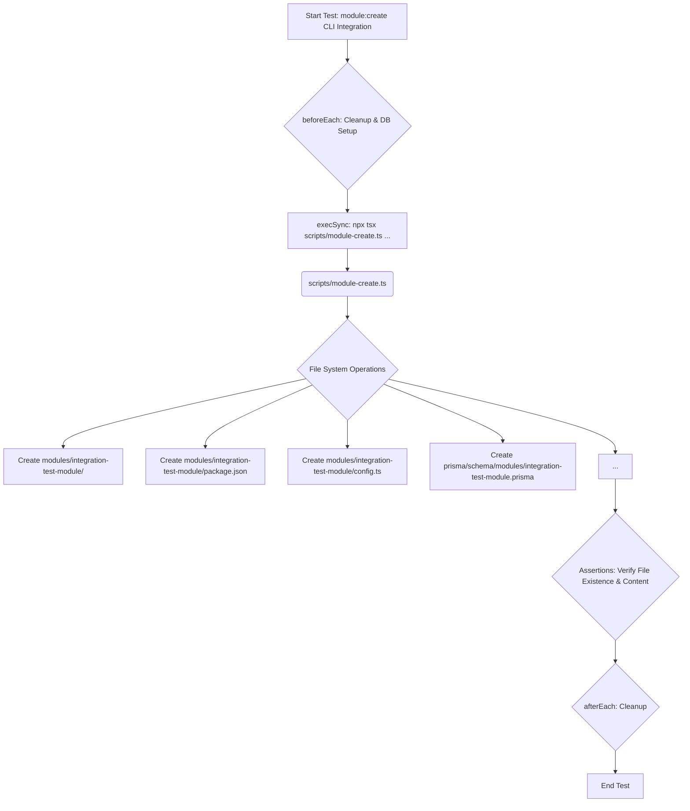

# Other — tests

This document provides an overview of the test suite for the module management CLI scripts, located under `scripts/tests`. These tests ensure the reliability and correctness of the `module-create`, `module-list`, and `module-remove` commands, which are critical for scaffolding and managing modules within the application.

## Overview

The `scripts/tests` module contains integration and unit tests for the CLI tools responsible for managing application modules. These tests use `vitest` as the testing framework and `node:child_process.execSync` to execute the actual CLI commands, simulating a user's interaction. They verify command-line argument parsing, file system operations, and database interactions where applicable.

The primary goal of these tests is to:
*   Ensure new modules are correctly scaffolded with the expected file structure and content.
*   Validate input parameters for CLI commands.
*   Verify error handling for invalid inputs or non-existent resources.
*   Confirm the correct behavior of listing and removing modules.

## Testing Strategy

The tests employ a combination of approaches:

1.  **Integration Testing**: For `module-create`, a comprehensive integration test (`module-create-integration.test.ts`) runs the full scaffolding process, creates files and directories, and asserts their existence and content. This includes interaction with the database via `PrismaClient` to ensure necessary prerequisites (like `Section` records) are met.
2.  **Unit/Validation Testing**: Other tests, particularly `module-create.test.ts` and `module-remove.test.ts`, focus on validating input and error conditions, ensuring the CLI commands fail gracefully with incorrect usage.
3.  **File System Isolation**: Each test suite uses `beforeEach` and `afterEach` hooks to perform cleanup operations, ensuring that tests run in a clean and predictable environment, free from artifacts of previous runs. This involves creating and removing temporary module directories and Prisma schema files.

## Test Suites

### `scripts/tests/module-create-integration.test.ts`

This file contains a full integration test for the `scripts/module-create.ts` CLI command. It simulates the creation of a new module and verifies that all expected files and configurations are generated correctly.

**Key Aspects:**

*   **Setup (`beforeEach`)**:
    *   Cleans up any leftover module directories (`modules/integration-test-module`) and Prisma schema files (`prisma/schema/modules/integration-test-module.prisma`) from previous runs.
    *   Ensures a `section` with the slug `operations` exists in the database using `prisma.section.upsert`. This is crucial as the `module-create` command requires a valid section slug.
*   **Teardown (`afterEach`)**:
    *   Performs the same cleanup as `beforeEach` to ensure a clean state after the test completes.
*   **Test Case**:
    *   Executes the `module-create.ts` script in non-interactive mode using `execSync`.
    *   Provides all necessary arguments: slug (`integration-test-module`), names (`Test Arabic`, `Test English`), section slug (`operations`), and icon (`📦`).
    *   Asserts the existence of a wide range of generated files and directories, including:
        *   `modules/integration-test-module/` (the module root)
        *   `package.json`
        *   `config.ts`
        *   `add.conversation.ts`
        *   `schema.prisma` (within the module directory)
        *   `locales/ar.ftl` and `locales/en.ftl`
        *   `tests/flow.test.ts`
        *   `prisma/schema/modules/integration-test-module.prisma` (the main Prisma schema file)
    *   Verifies the content of the generated `package.json` for correct `name`, `version`, `private` status, `type`, and `dependencies` (specifically `@al-saada/module-kit`).

**Execution Flow:**

### `scripts/tests/module-create.test.ts`

This file focuses on validating the input parameters and basic error handling for the `scripts/module-create.ts` command.

**Key Aspects:**

*   **Setup/Teardown**: Similar cleanup of `MODULE_PATH` and `SCHEMA_PATH` as the integration test.
*   **Test Cases**:
    *   `fails when slug is invalid`: Executes `module-create.ts` with an invalid slug (e.g., `Invalid_Slug`) and asserts that the command throws an error.
    *   `fails when no slug is provided`: Executes `module-create.ts` without any slug argument and asserts that it throws an error.
*   **Note**: The documentation explicitly mentions the limitations of testing interactive prompts with `execSync`, focusing instead on non-interactive or argument-driven scenarios.

### `scripts/tests/module-list.test.ts`

This file tests the `scripts/module-list.ts` command, specifically its behavior when no modules are present in the system.

**Key Aspects:**

*   **Setup (`beforeEach`)**:
    *   Ensures the `modules/` directory is empty by recursively removing all subdirectories within it. This creates a controlled environment where no modules exist.
*   **Test Case**:
    *   Executes the `module-list.ts` script using `execSync`.
    *   Asserts that the command's output contains the expected message: `"No modules found in modules/ directory."`

### `scripts/tests/module-remove.test.ts`

This file tests the error handling of the `scripts/module-remove.ts` command.

**Key Aspects:**

*   **Test Cases**:
    *   `fails when no slug is provided`: Executes `module-remove.ts` without any slug argument and asserts that the command throws an error.
    *   `fails when slug does not exist`: Executes `module-remove.ts` with a slug that does not correspond to an existing module (e.g., `non-existent-slug`) and asserts that the command throws an error.

## Key Utilities and Patterns

*   **`vitest`**: The primary testing framework, providing `describe`, `it`, `expect`, `beforeEach`, and `afterEach` functions.
*   **`node:child_process.execSync`**: Used to execute CLI commands as if they were run from the terminal. The `stdio: 'pipe'` option captures output and errors, while `env: { ...process.env, NODE_ENV: 'test' }` ensures the script runs in a test environment.
*   **`node:fs` and `node:path`**: Essential for interacting with the file system:
    *   `fs.existsSync()`: To check if files or directories exist.
    *   `fs.rmSync()`: To recursively remove directories and their contents.
    *   `fs.unlinkSync()`: To remove individual files.
    *   `fs.readFileSync()`: To read the content of generated files (e.g., `package.json`).
    *   `path.join()`: For constructing platform-agnostic file paths.
*   **`PrismaClient`**: Used in `module-create-integration.test.ts` to interact with the database, specifically to ensure a `Section` record exists before module creation. This highlights the integration with the application's data layer.

## Contribution Guidelines

When contributing to these tests or adding new ones:

*   **Maintain Isolation**: Always use `beforeEach` and `afterEach` to clean up any file system or database changes made by your tests. This ensures tests are independent and repeatable.
*   **Focus on CLI Behavior**: Remember that these are tests for CLI scripts. Use `execSync` to run the scripts and assert on their exit codes, standard output, standard error, and resulting file system/database state.
*   **Avoid Mocking CLI Internals**: The goal is to test the actual CLI scripts, not their internal functions. If you need to test specific logic, consider adding unit tests to the script's source file directly, or refactor the logic into a separate, testable utility.
*   **Clear Assertions**: Make assertions specific and clear. For file system checks, verify both existence and, where appropriate, content. For CLI output, use `toContain` for expected messages.
*   **Error Handling**: Explicitly test scenarios where the CLI command is expected to fail (e.g., invalid arguments, missing resources) using `expect(() => ...).toThrow()`.
