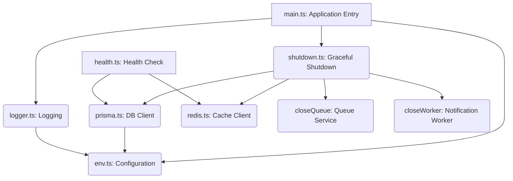

# System Infrastructure

The System Infrastructure module provides the foundational services and utilities that underpin the entire application. It handles critical aspects such as environment configuration, logging, database management, application lifecycle (startup and graceful shutdown), and health monitoring. This module ensures the application is robust, observable, and operates reliably.

## Key Components

This module is composed of several interconnected files, each responsible for a specific infrastructure concern:

### 1. Environment Configuration (`packages/core/src/config/env.ts`)

This file defines and validates all environment variables required by the application.

*   **Purpose**: To provide a centralized, type-safe, and validated source for application configuration.
*   **How it works**:
    *   It uses the `zod` library to define `envSchema`, a schema that specifies expected environment variables, their types, and validation rules (e.g., `BOT_TOKEN` must be a non-empty string, `WEBHOOK_URL` must be a valid URL).
    *   Default values are provided for optional variables like `REDIS_URL`, `PORT`, `NODE_ENV`, and `LOG_LEVEL`.
    *   `process.env` is parsed against this schema, and any validation failures will cause the application to exit early with a descriptive error.
*   **Usage**: The validated environment object `env` is exported and imported by other modules (e.g., `prisma.ts`, `logger.ts`, `main.ts`) to access configuration values. The `EnvSchema` type is also exported for type safety.

### 2. Logging (`packages/core/src/utils/logger.ts`)

This utility provides a consistent and configurable logging mechanism for the application.

*   **Purpose**: To centralize application logging, making it easy to monitor application behavior and debug issues.
*   **How it works**:
    *   It leverages `pino`, a highly performant Node.js logger.
    *   The log level is configured dynamically based on `env.LOG_LEVEL`.
    *   In `development` mode (`env.NODE_ENV === 'development'`), `pino-pretty` is used to format logs for better human readability in the console.
    *   It includes formatters to ensure proper UTF-8 encoding, which is crucial for displaying Arabic text correctly.
*   **Usage**: The `logger` instance is exported as the default and should be imported and used by all other modules for logging messages at various levels (e.g., `logger.info()`, `logger.error()`).

### 3. Database Management (`packages/core/src/database/prisma.ts`)

This file manages the application's connection to the PostgreSQL database via Prisma ORM.

*   **Purpose**: To provide a singleton `PrismaClient` instance for all database interactions and manage its lifecycle.
*   **How it works**:
    *   The `getPrismaInstance()` function implements a singleton pattern, ensuring that only one `PrismaClient` instance is created throughout the application's lifetime.
    *   Prisma's logging is configured based on `env.NODE_ENV`, enabling detailed query logs in development.
    *   The `prisma` client is exported for direct use in other parts of the application.
    *   The `disconnect()` function provides a mechanism to gracefully close the database connection, which is crucial during application shutdown.
*   **Usage**: Other modules requiring database access import the `prisma` client. The `disconnect` function is called during graceful shutdown.

### 4. Application Entry Point & Lifecycle (`packages/core/src/main.ts`)

This is the main entry point of the application, orchestrating the startup process and setting up core services.

*   **Purpose**: To initialize the application, configure the bot's operational mode, and register the graceful shutdown handler.
*   **How it works**:
    *   The `main` asynchronous function is executed on startup.
    *   It initializes the `logger` and registers the `handleGracefulShutdown` utility.
    *   It determines the bot's operational mode based on `env.WEBHOOK_URL`:
        *   If `WEBHOOK_URL` is set, the bot operates in **webhook mode**. It sets the webhook URL via `bot.api.setWebhook()` and starts an HTTP server using `@hono/node-server` on `env.PORT` to listen for incoming updates.
        *   If `WEBHOOK_URL` is not set, the bot operates in **long polling mode** by calling `bot.start()`.
    *   It imports `./workers/notification`, which implicitly starts the notification worker.
    *   Any fatal errors during startup are caught, logged, and cause the process to exit.
*   **Usage**: This file is the primary executable for the application.

### 5. Health Monitoring (`packages/core/src/server/health.ts`)

This file provides an HTTP endpoint for checking the health status of critical services.

*   **Purpose**: To offer a `/health` endpoint that external monitoring systems can query to ascertain the application's operational status and its dependencies.
*   **How it works**:
    *   It defines a Hono router, `healthRouter`, with a GET endpoint at `/health`.
    *   When accessed, it performs checks on key services:
        *   **Redis**: Attempts to `ping()` the Redis client.
        *   **Database**: Executes a simple `SELECT 1` query against the database via Prisma.
    *   It aggregates the status of these services and returns a JSON response indicating overall health and individual service statuses.
    *   The HTTP status code is 200 if all services are healthy, and 503 (Service Unavailable) if any critical service is down.
*   **Usage**: This router is expected to be registered with the main Hono application instance (e.g., in `packages/core/src/bot/index.ts`) to expose the `/health` endpoint.

### 6. Graceful Shutdown (`packages/core/src/utils/shutdown.ts`)

This utility ensures that the application can shut down cleanly, releasing resources and preventing data loss.

*   **Purpose**: To implement a robust graceful shutdown procedure that responds to termination signals and unhandled errors.
*   **How it works**:
    *   The `handleGracefulShutdown(bot)` function sets up listeners for `SIGINT` (Ctrl+C), `SIGTERM` (termination signal), `uncaughtException`, and `unhandledRejection`.
    *   When a shutdown signal is received, the `cleanup` function is invoked. This function orchestrates the shutdown sequence:
        1.  Stops the Telegram bot from accepting new updates (`bot.stop()`).
        2.  Closes the notification worker and queue (`closeWorker()`, `closeQueue()`).
        3.  Disconnects from Redis (`disconnectRedis()`).
        4.  Disconnects from the database (`disconnectPrisma()`).
        5.  Exits the process with a success code (0) or an error code (1) if cleanup fails.
    *   `uncaughtException` and `unhandledRejection` handlers log the error and immediately exit, preventing the application from running in an undefined state.
*   **Usage**: `handleGracefulShutdown` is called once during application startup in `main.ts`.

## Architecture Overview

The System Infrastructure module forms the backbone of the application, with `main.ts` acting as the orchestrator. Configuration (`env.ts`) and Logging (`logger.ts`) are fundamental dependencies for almost all other components. The `shutdown.ts` utility is crucial for maintaining application integrity during termination, while `health.ts` provides external observability.

## Integration Points

*   **Configuration**: The `env` object from `env.ts` is a primary dependency for `prisma.ts`, `logger.ts`, and `main.ts`.
*   **Logging**: The `logger` instance from `logger.ts` is widely used across `prisma.ts`, `main.ts`, `health.ts`, and `shutdown.ts` for all application logging.
*   **Database**: The `prisma` client from `prisma.ts` is used by `health.ts` for database connectivity checks and its `disconnect` function is called by `shutdown.ts`.
*   **Redis**: The `redis` client (from `../cache/redis`, not shown in provided code but implied by `REDIS_URL` and `disconnectRedis`) is used by `health.ts` for connectivity checks and its `disconnect` function is called by `shutdown.ts`.
*   **Application Lifecycle**: `main.ts` initiates the application and registers `handleGracefulShutdown` from `shutdown.ts`.
*   **Health Endpoint**: The `healthRouter` from `health.ts` is expected to be mounted onto the main Hono application instance (e.g., `app` in `packages/core/src/bot/index.ts`) to expose the `/health` endpoint.

## Contribution Guidelines

When contributing to or extending the system infrastructure:

*   **Environment Variables**: If new configuration variables are needed, define them in `packages/core/src/config/env.ts` within `envSchema`. Ensure they have appropriate Zod validators and sensible default values if optional.
*   **Logging**: Always use the `logger` instance from `packages/core/src/utils/logger.ts` for all application logging. Avoid `console.log` directly.
*   **Database Interactions**: All database operations should go through the `prisma` client exported from `packages/core/src/database/prisma.ts`.
*   **New Services**: If introducing new external services (e.g., another message broker, a new API client with persistent connections), ensure they are:
    *   Configured via `env.ts`.
    *   Monitored via `packages/core/src/server/health.ts` by adding a new health check.
    *   Gracefully disconnected via `packages/core/src/utils/shutdown.ts` by adding a new disconnection call to the `cleanup` function.
*   **Error Handling**: Follow the patterns in `main.ts` and `shutdown.ts` for handling fatal errors and unhandled rejections, ensuring the application exits gracefully or logs critical issues.