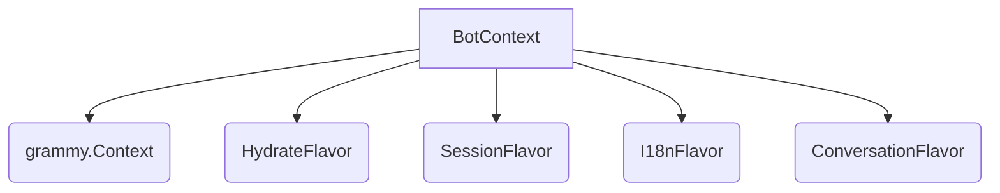

# Type Definitions

# Type Definitions Module

This module, located at `packages/core/src/types`, centralizes and defines core TypeScript types used throughout the application. Its primary purpose is to ensure type safety, consistency, and clarity across different components, particularly those interacting with the Telegram Bot API context and background notification systems.

## Purpose

The Type Definitions module serves as the single source of truth for critical data structures and extended contexts. By defining these types in a dedicated location, it:

*   **Enhances Type Safety**: Ensures that data passed between functions and modules conforms to expected structures.
*   **Improves Readability**: Makes code easier to understand by clearly defining the shape of objects.
*   **Facilitates Maintenance**: Simplifies refactoring and debugging by providing clear type contracts.
*   **Integrates External Libraries**: Seamlessly extends types from external libraries like `grammy` and `@prisma/client` with application-specific data.

## Key Components

The module is divided into two main files, each responsible for a distinct set of type definitions:

### 1. `context.ts` - Bot Context and Session Data

This file defines the extended `Context` object used by the Telegram bot and the structure for session-specific data.

#### `SessionData`

An interface defining the structure of data stored in the user's session. This data persists across messages and interactions, allowing the bot to maintain state for individual users.

```typescript
export interface SessionData {
  userId?: number // The Telegram user ID
  role?: string // User's role (e.g., 'admin', 'user')
  language?: string // User's preferred language code
  currentSection?: string | null // Current section the user is navigating
  currentModule?: string | null // Current module the user is interacting with
  currentStep?: string // Current step within a module/section
  lastActivity?: number // Timestamp of the user's last interaction
  __language_code?: string // Internal i18n language code
}
```

#### `BotContext`

A composite type that extends `grammy`'s base `Context` with various "flavors" from popular grammY plugins. This type is fundamental for all bot handlers and middleware, providing access to session data, internationalization functions, conversation management, and more.

```typescript
export type BotContext = Context &
  HydrateFlavor<Context> &
  SessionFlavor<SessionData> &
  I18nFlavor &
  ConversationFlavor
```

This composition ensures that any `BotContext` object passed to a handler will have properties and methods added by:

*   `HydrateFlavor`: For hydrating plain objects into full Telegram API objects.
*   `SessionFlavor<SessionData>`: For accessing and modifying user-specific `SessionData`.
*   `I18nFlavor`: For internationalization capabilities (e.g., `ctx.t('key')`).
*   `ConversationFlavor`: For managing multi-step conversations.

The structure of `BotContext` can be visualized as:



### 2. `notification.ts` - Notification System Types

This file defines types related to the application's background notification system, particularly for job queues and results.

#### `NotificationType`

This type is re-exported directly from `@prisma/client`. It represents an enum defining the different categories or kinds of notifications that can be sent to users (e.g., `REMINDER`, `UPDATE`, `ALERT`). Its definition is managed by the Prisma schema.

```typescript
export { NotificationType } from '@prisma/client'
```

#### `NotificationJobData`

An interface defining the payload required to schedule a notification job in a background queue. This ensures that all necessary information for sending a notification is consistently provided.

```typescript
export interface NotificationJobData {
  targetUserId: bigint // The ID of the user to receive the notification
  type: NotificationType // The category of the notification
  params?: Record<string, string> // Optional parameters for templating the notification message
}
```

#### `NotificationResult`

An interface defining the expected structure of the result returned after a notification job has been processed. This allows for consistent error handling and tracking of notification delivery status.

```typescript
export interface NotificationResult {
  success: boolean // True if the notification was sent successfully
  notificationId: string // A unique identifier for the notification attempt
  error?: string // Optional error message if the notification failed
}
```

## Integration and Usage

*   **`BotContext`**: This type is extensively used in all bot handlers, middleware, and conversation steps. Any function that needs access to the Telegram context, user session, or i18n capabilities will typically accept `ctx: BotContext` as an argument.
*   **`SessionData`**: While not directly used as a function argument, `SessionData` defines the shape of `ctx.session`. Developers interact with it by reading from or writing to `ctx.session.propertyName`.
*   **`NotificationJobData`**: This type is used when enqueuing new notification tasks into a job queue (e.g., BullMQ, Faktory). Any service responsible for scheduling notifications will construct objects conforming to this interface.
*   **`NotificationResult`**: Services that process notification jobs will return objects of this type, which can then be used by the job queue system or monitoring tools to track outcomes.
*   **`NotificationType`**: Used in conjunction with `NotificationJobData` to categorize notifications and potentially influence how they are processed or rendered.