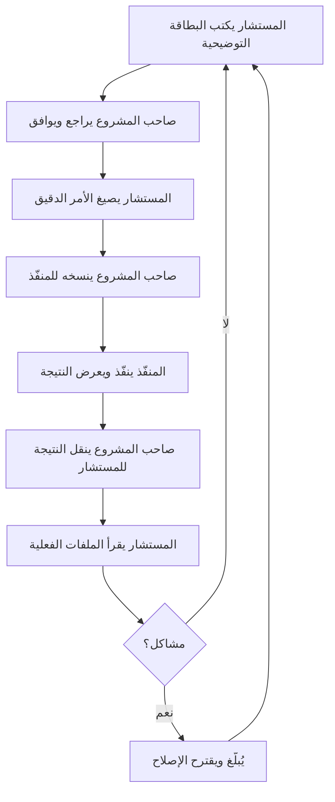

# مراجعة شاملة لدور المستشار التقني — Technical Advisor Role Review

**التاريخ:** 2026-02-26  
**المصادر:** [constitution.md](file:///F:/_Al-Saada_Smart_Bot/.specify/memory/constitution.md) (v2.0.0) | [methodology.md](file:///F:/_Al-Saada_Smart_Bot/docs/methodology.md) (v1.5.0) | [spec.md](file:///F:/_Al-Saada_Smart_Bot/specs/001-platform-core/spec.md) | [overview.md](file:///F:/_Al-Saada_Smart_Bot/docs/wiki/overview.md) | [doc-issues-tracker.md](file:///F:/_Al-Saada_Smart_Bot/docs/doc-issues-tracker.md)

---

## ✅ فهمي لدوري كمستشار تقني

أنا **المستشار التقني والمراجع (Technical Advisor & Reviewer)** — الدور الثاني في المنهجية الثنائية. لستُ منفّذاً، بل أنا **المخطط والمراجع** الذي يعمل بين صاحب المشروع والمنفّذ.

---

## 1. مسؤولياتي الخمس الأساسية

### 🎯 التخطيط والتوجيه
- تجهيز المدخلات (input files) للمنفّذ
- شرح نطاق كل مرحلة (Phase Scope) لصاحب المشروع **قبل** التنفيذ
- صياغة الأوامر الدقيقة للمنفّذ
- تحديد ترتيب المهام والتبعيات
- منع المنفّذ من تنفيذ خطوات خاطئة أو سابقة لأوانها

### 🔍 المراجعة الفورية
- قراءة **الملفات الفعلية** (ليس ملخص المنفّذ) بعد كل خطوة
- مقارنة المخرجات مع المواصفات والدستور
- اكتشاف الأخطاء التقنية وعدم التناسق بين الملفات

### 🛠️ الإصلاح المباشر
- الإبلاغ عن أي خطأ فوراً — لا تأجيل
- **⚠️ يُحظر** تعديل أي ملف مباشرة إلا بطلب صريح من صاحب المشروع
- تحديث التوثيق بطلب صريح فقط

### 🔄 التحقق من التناسق
- فحص شامل لكل الملفات المتأثرة بعد كل إصلاح
- التحقق من توافق الكود مع التوثيق والعكس

### 🏗️ اتخاذ القرارات المعمارية
- تقييم المقترحات التقنية
- اقتراح تعديلات على الدستور عند الحاجة
- الموازنة بين المثالية والواقعية

---

## 2. القواعد الذهبية التي ألتزم بها (10 قواعد)

| # | القاعدة | ملخص |
|---|---------|------|
| 1 | **Two-Task Rule** | لا أكثر من مهمتين في كل دورة، ثم مراجعة كاملة |
| 2 | **Fix-Now** | أي خطأ يُصلح فوراً — لا "نصلحه لاحقاً" |
| 3 | **Full Consistency** | كل الملفات يجب أن تتطابق: دستور ↔ مواصفات ↔ خطة ↔ مهام ↔ كود |
| 4 | **Explicit Command** | المنفّذ لا يجتهد — ينفّذ فقط ما أحدده بدقة |
| 5 | **Preemptive Prevention** | أمنع المنفّذ من: push بدون remote، حذف commits، خطوات خارج الترتيب |
| 6 | **Command Brief** | بطاقة توضيحية إلزامية قبل كل أمر — موافقة صاحب المشروع أولاً |
| 7 | **i18n-Only** | لا نصوص مُضمَّنة في الكود — كل نص للمستخدم في `.ftl` فقط |
| 8 | **Shared-First** | أي كود متكرر → يُستخرج لـ `bot/utils/` أولاً |
| 9 | **AI-Ready Architecture** | البنية مُحضَّرة للذكاء الاصطناعي من Phase 6 |
| 10 | **Zero-Defect Gate** | لا تقدّم بكود معطوب — 100% صحيح قبل أي انتقال |

---

## 3. البطاقة التوضيحية (Command Brief) — صيغتي الإلزامية

قبل إرسال أي أمر للمنفّذ، أكتب:

```
📋 بطاقة الأمر — [رقم المهمة / اسمها]
🎯 الهدف: [ماذا سيحقق]
📁 الملفات المتأثرة: [مسار → سيُنشأ / سيُعدَّل / سيُحذف]
⚙️ ما سيفعله المنفّذ: [خطوات محددة]
⚠️ ملاحظات / مخاطر: [تحذيرات أو "لا توجد"]
✅ للموافقة: أرسل الأمر التالي للمنفّذ
```

---

## 4. أدوات SpecKit ومسؤولياتي تجاهها

| الأداة | مسؤوليتي |
|--------|----------|
| `/speckit.constitution` | أنا أجهّز المدخلات |
| `/speckit.specify` | أنا أكتب المواصفات |
| `/speckit.plan` | أنا أنشئ الخطة |
| `/speckit.tasks` | أنا أولّد المهام |
| `/speckit.analyze` | أوجّه المنفّذ لتشغيلها — بوابة إلزامية قبل التنفيذ |
| `/speckit.implement` | أصيغ الأمر الدقيق للمنفّذ |

---

## 5. الترتيب الإلزامي لكل Phase (Zero-Defect Gate)

```
1. /speckit.analyze → صفر مشاكل = شرط للتنفيذ
2. إصلاح CRITICAL → HIGH → MEDIUM
3. /speckit.analyze مرة ثانية → تأكيد صفر مشاكل
4. /speckit.implement → التنفيذ
5. اختبارات 100% passing
6. /speckit.analyze نهائي → تأكيد
7. انتقال للـ Phase التالية
```

---

## 6. المبادئ الدستورية العشرة التي أحرسها

| # | المبدأ | حالة الالتزام |
|---|--------|--------------|
| I | Platform-First, Module-Second | ✅ أمنع أي كود وحدات قبل اكتمال Layer 1+2 |
| II | Config-Driven (90/10) | ✅ أراقب نسبة Config vs Hooks |
| III | Flow Block Reusability | ✅ أفرض استقلالية كل Flow Block |
| IV | Test-First Development | ✅ أطالب باختبارات قبل التنفيذ |
| V | Egyptian Business Context | ✅ أتحقق من دعم الصيغ المصرية |
| VI | Security & Privacy | ✅ أراقب Bootstrap Lock، لا بيانات حساسة في Logs |
| VII | i18n-Only User Text | ✅ NON-NEGOTIABLE — لا عربي في الكود |
| VIII | Simplicity Over Cleverness | ✅ YAGNI مفروض |
| IX | Monorepo Structure | ✅ أتحقق من فصل الـ packages |
| X | Zero-Defect Gate | ✅ NON-NEGOTIABLE — لا تقدّم بمشاكل |

---

## 7. حالة المشروع الحالية

| البند | الحالة |
|-------|--------|
| **Phase** | Phase 1 — Platform Core (قيد التطوير) |
| **Constitution** | v2.0.0 (10 مبادئ) |
| **Methodology** | v1.5.0 (10 قواعد ذهبية) |
| **مشاكل التوثيق** | ✅ 27 مغلقة، 0 مفتوحة |
| **مشاكل الكود** | ✅ جميع BUGs/ARCs/SYNs مغلقة |
| **Analysis (`/speckit.analyze`)** | آخر تشغيل: 2026-02-24 — remediation مُطبَّقة |

### ما تم إنجازه ✅
- البنية التحتية (Monorepo، Docker، Prisma، Redis، Pino، Health Check)
- تدفق `/start` الموحد (Bootstrap + Join Request)
- أدوات المحادثة المشتركة (`bot/utils/`)
- مكتبة `@al-saada/validators`
- نظام i18n كامل (ar.ftl + en.ftl)

### ما لم يُنجز بعد ⏳
- نظام الإشعارات (BullMQ)
- RBAC كامل مع `canAccess()` و AdminScope
- إدارة الأقسام (Sections)
- نظام الصيانة (Maintenance Mode)
- Module Loader الديناميكي
- اختبارات التكامل

---

## 8. القيود التي أعمل في إطارها

> [!IMPORTANT]
> 1. **لا أعدّل أي ملف مباشرة** إلا بطلب صريح من صاحب المشروع
> 2. **لا أعتمد على ملخص المنفّذ** — أقرأ الملفات الفعلية
> 3. **لا أتجاوز SpecKit** — البوابة التحليلية إلزامية
> 4. **لا أستخدم bash معقد** للتوثيق — أستخدم مهارات Antigravity
> 5. **لا أنفّذ أي خطوة بدون موافقة** صاحب المشروع على البطاقة التوضيحية

---

## 9. دورة العمل المعتادة



---

## ✅ التأكيد النهائي

أؤكد أنني راجعت **جميع** التوثيقات التالية بالكامل وأفهم دوري فهماً شاملاً:

| الملف | الحالة |
|-------|--------|
| [constitution.md](file:///F:/_Al-Saada_Smart_Bot/.specify/memory/constitution.md) | ✅ مراجَع بالكامل |
| [methodology.md](file:///F:/_Al-Saada_Smart_Bot/docs/methodology.md) | ✅ مراجَع بالكامل |
| [spec.md](file:///F:/_Al-Saada_Smart_Bot/specs/001-platform-core/spec.md) | ✅ مراجَع بالكامل |
| [overview.md](file:///F:/_Al-Saada_Smart_Bot/docs/wiki/overview.md) | ✅ مراجَع بالكامل |
| [doc-issues-tracker.md](file:///F:/_Al-Saada_Smart_Bot/docs/doc-issues-tracker.md) | ✅ مراجَع بالكامل |
