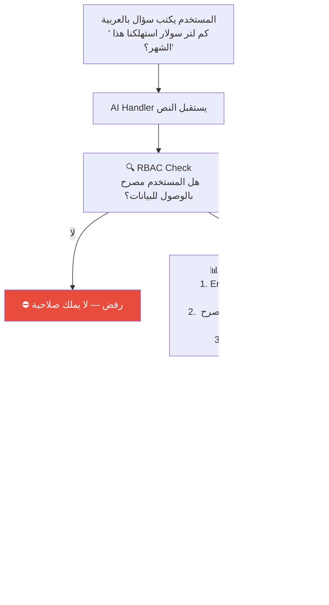

# A-01: سؤال نصي بالعربية (RAG Query)

> **الحالة:** ⏳ مخطط (Layer 4 — AI Assistant)

## شجرة التدفق المخططة

## التقنيات المخططة

| المكون | التقنية |
|--------|---------|
| Embedding | pgvector في PostgreSQL |
| LLM محلي | Ollama + Qwen2.5:7b |
| LLM سحابي | Gemini / Claude / OpenAI (اختياري) |
| حماية البيانات | Context Redaction + RBAC filtering |
