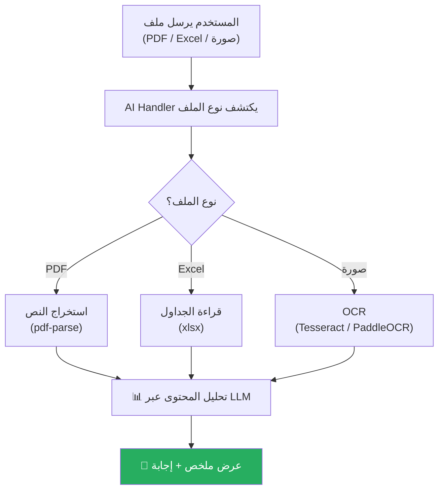

# A-02: تحليل ملف مرفق (File Analysis)

> **الحالة:** ⏳ مخطط (Layer 4 — AI Assistant)

## شجرة التدفق المخططة

## أنواع الملفات المدعومة (مخطط)

| النوع | المكتبة | الحجم الأقصى |
|-------|---------|-------------|
| PDF | `pdf-parse` | 10MB |
| Excel (.xlsx) | `xlsx` / `exceljs` | 5MB |
| صورة (JPG/PNG) | Tesseract / PaddleOCR | 5MB |
| Word (.docx) | مخطط لاحقاً | — |
