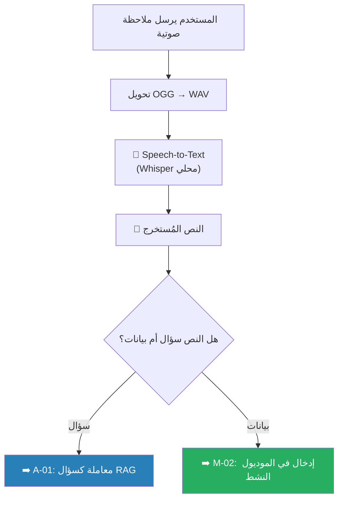

# A-03: ملاحظة صوتية (Voice Note)

> **الحالة:** ⏳ مخطط (Layer 4 — AI Assistant)

## شجرة التدفق المخططة

## التقنيات المخططة

| المكون | التقنية | ملاحظة |
|--------|---------|--------|
| Speech-to-Text | Whisper (محلي عبر Ollama) | يدعم العربية |
| تحويل الصوت | ffmpeg | OGG → WAV |
| التصنيف | LLM | تحديد نية المستخدم (سؤال أم إدخال بيانات) |
