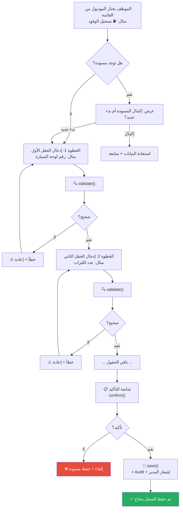

# B-01: تسجيل بيانات — نموذج عام (Generic Data Entry)

> **الحالة:** ⏳ نموذج (يُبنى حسب احتياج الشركة)

## شجرة التدفق

## مثال: موديول تسجيل الوقود

| الحقل | النوع | تحقق |
|-------|------|------|
| رقم اللوحة | `string` | نمط لوحات مصرية |
| عدد اللترات | `number` | 1–999 |
| قراءة العداد | `number` | أكبر من آخر قراءة |
| ملاحظات | `string` | اختياري |
