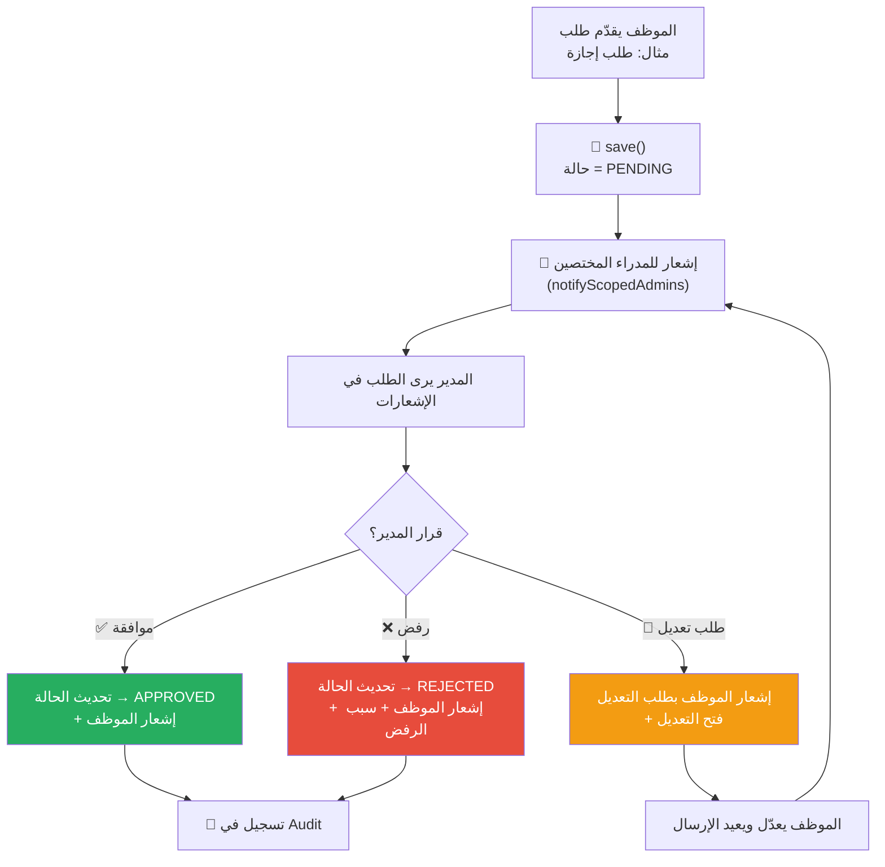

# B-02: طلب يحتاج موافقة مدير (Approval Workflow)

> **الحالة:** ⏳ نموذج (يُبنى حسب احتياج الشركة)

## شجرة التدفق

## مثال: طلب إجازة

| المرحلة | من | الفعل |
|---------|-----|------|
| تقديم | الموظف | يختار نوع (سنوية/مرضية) + التاريخ + المدة |
| مراجعة | Admin/Super Admin | يرى التفاصيل + يقرر |
| نتيجة | النظام | إشعار الموظف بالقرار |

## الفرق عن B-01

- في B-01 البيانات تُحفظ مباشرة (save → done).
- في B-02 البيانات تُحفظ بحالة `PENDING` ثم تنتظر قرار المدير.
