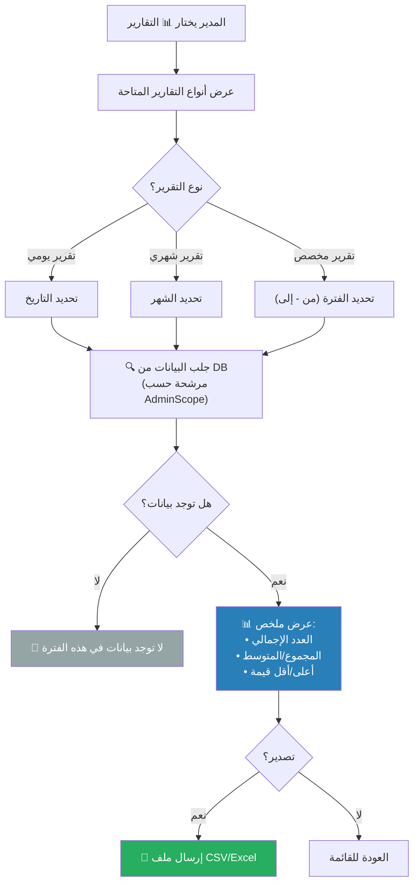

# B-03: عرض تقرير (Report View)

> **الحالة:** ⏳ نموذج (يُبنى حسب احتياج الشركة)

## شجرة التدفق

## أمثلة تقارير ممكنة

| التقرير | البيانات | متاح لـ |
|---------|---------|--------|
| استهلاك الوقود | إجمالي لترات + تكلفة لكل سيارة | ADMIN, SUPER_ADMIN |
| الحضور | أيام حضور/غياب لكل موظف | ADMIN, SUPER_ADMIN |
| المصروفات | إجمالي مصروفات حسب الفئة | ADMIN, SUPER_ADMIN |
| طلبات الإجازة | حالة الطلبات (معلقة/مقبولة/مرفوضة) | ADMIN, SUPER_ADMIN |

## ملاحظة RBAC

- **SUPER_ADMIN**: يرى تقارير كل الأقسام.
- **ADMIN**: يرى فقط تقارير الأقسام ضمن `AdminScope` الخاص به.
- **EMPLOYEE**: لا يرى التقارير العامة (فقط بياناته الشخصية إذا أُتيح).
