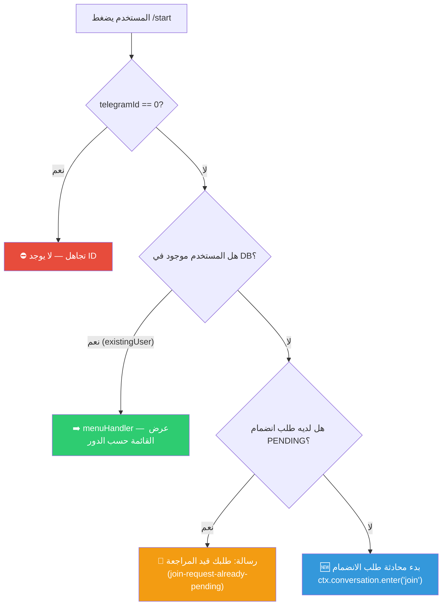

# C-01: أول تفاعل مع البوت (`/start`)

> **الملف المصدري:** `packages/core/src/bot/handlers/start.ts`
> **الحالة:** ✅ مُنفذ

## شجرة التدفق

## جدول الخطوات

| # | حالة المستخدم | فعل المستخدم | استجابة البوت | مفتاح i18n |
|---|-------------|-------------|--------------|-----------|
| 1 | مسجل وفعّال | يضغط `/start` | يعرض القائمة الرئيسية حسب الدور | `menu-super_admin` / `menu-admin` / `menu-employee` |
| 2 | مسجل وغير فعّال | يضغط `/start` | رسالة "حسابك غير مفعل" | `user-inactive` |
| 3 | غير مسجل + طلب معلق | يضغط `/start` | رسالة "طلبك قيد المراجعة" مع التاريخ | `join-request-already-pending` |
| 4 | غير مسجل + لا طلب | يضغط `/start` | يدخل محادثة الانضمام | — |
| 5 | خطأ في الـ handler | يضغط `/start` | رسالة خطأ عامة | `error-generic` |

## الحالات الاستثنائية

- **telegramId = 0**: يتم تجاهل الطلب بالكامل (حماية من رسائل بدون مُرسل).
- **خطأ في قاعدة البيانات**: يُلتقط في `catch` ويُعرض `error-generic`.

## ملاحظات

- لا يوجد منطق Bootstrap في `start.ts` — هذا المنطق موجود في `joinRequestService.createOrBootstrap()` داخل محادثة الانضمام.
- المستخدم المسجل يُحوّل مباشرة لـ `menuHandler` بغض النظر عن دوره.
