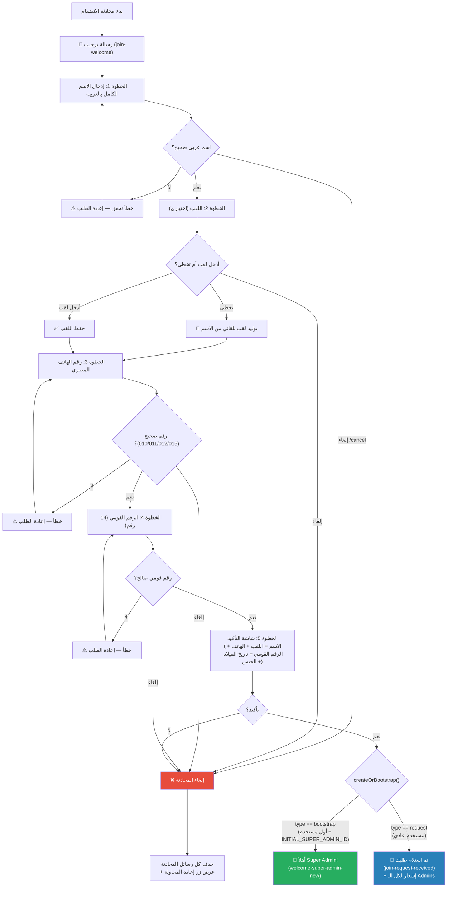

# C-02: طلب الانضمام (Join Request)

> **الملف المصدري:** `packages/core/src/bot/conversations/join.ts`
> **الحالة:** ✅ مُنفذ

## شجرة التدفق

## جدول الخطوات

| الخطوة | المطلوب من المستخدم | تحقق (Validation) | رسالة الخطأ |
|--------|-------------------|-------------------|------------|
| 1. الاسم | اسم عربي كامل | `askForArabicName` — أحرف عربية فقط | خطأ تحقق + إعادة |
| 2. اللقب | نص حر أو "تخطى" | اختياري — زر تخطى متاح | — |
| 3. الهاتف | رقم مصري | `askForPhone` — يبدأ بـ 010/011/012/015 | خطأ تحقق + إعادة |
| 4. الرقم القومي | 14 رقم | `askForNationalId` — استخراج تاريخ الميلاد والجنس | خطأ تحقق + إعادة |
| 5. التأكيد | ضغط زر ✅ أو ❌ | — | — |

## حالة Bootstrap

إذا كانت قاعدة البيانات فارغة (0 مستخدمين) و `telegramId` يطابق `INITIAL_SUPER_ADMIN_ID`:
- يتم إنشاء المستخدم فوراً بدور `SUPER_ADMIN`
- لا يحتاج موافقة أحد
- يظهر له `welcome-super-admin-new`

## الحالات الاستثنائية

- **إلغاء في أي خطوة**: حذف كل الرسائل + عرض زر "إعادة المحاولة" (`button-submit-join-request`)
- **خطأ في الخادم**: حذف الرسائل + `throw error` (يُلتقط بواسطة error middleware)
- **telegramId = 0**: رسالة `error-invalid-telegram-id` ثم خروج
