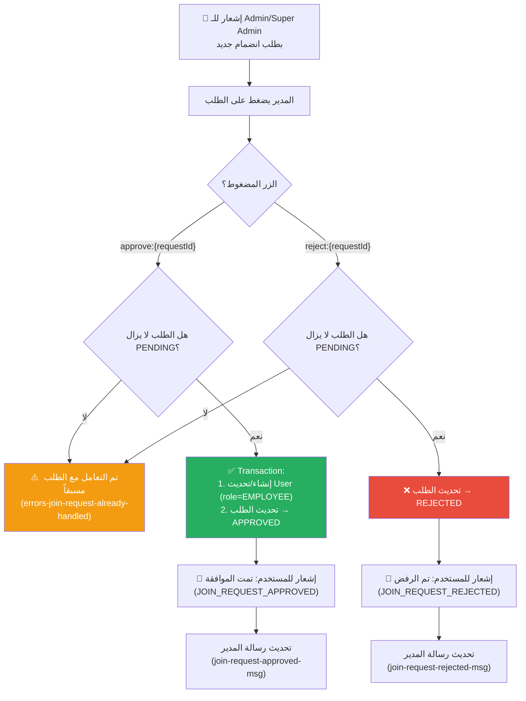

# C-03: مراجعة طلبات الانضمام (Join Approval)

> **الملف المصدري:** `packages/core/src/bot/handlers/approvals.ts`
> **الحالة:** ✅ مُنفذ

## شجرة التدفق

## جدول الخطوات

| # | فعل المدير | استجابة البوت | إشعار المستخدم | مفتاح i18n |
|---|-----------|-------------|---------------|-----------|
| 1 | يضغط "قبول" | إنشاء حساب User بدور EMPLOYEE | إشعار بالموافقة + اسم المدير + التاريخ | `join-request-approved-success` |
| 2 | يضغط "رفض" | تحديث حالة الطلب إلى REJECTED | إشعار بالرفض + اسم المدير + التاريخ | `join-request-rejected-success` |
| 3 | يضغط على طلب تم التعامل معه | رسالة: "تم التعامل مع هذا الطلب مسبقاً" | — | `errors-join-request-already-handled` |

## التفاصيل التقنية

- **Atomic Transaction**: القبول يتم داخل `prisma.$transaction` لضمان إنشاء المستخدم وتحديث الطلب معاً.
- **Upsert**: يستخدم `user.upsert` بدلاً من `create` لتجنب التكرار إذا كان المستخدم موجوداً.
- **Race Condition Protection**: يتحقق من `status === PENDING` داخل الـ Transaction لمنع قبول/رفض نفس الطلب مرتين.
- **الإشعارات**: تُرسل عبر `queueNotification` (BullMQ) وليس مباشرة.
