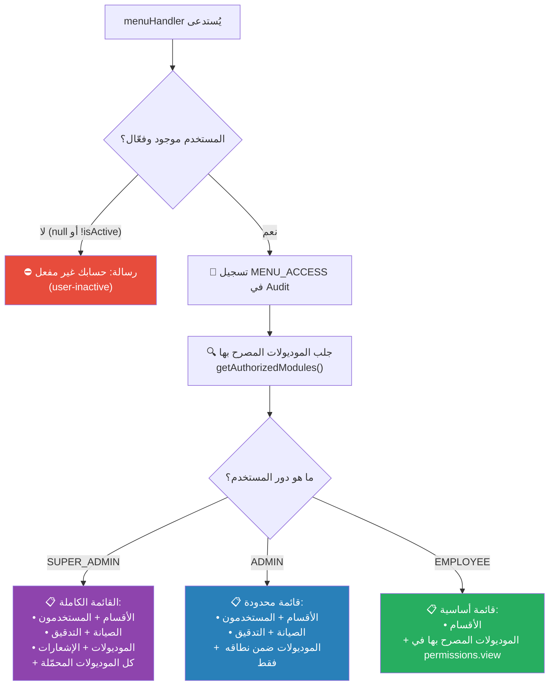
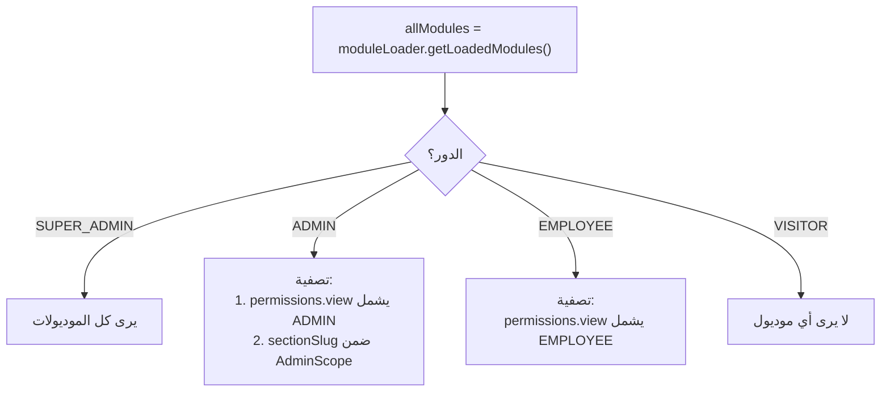

# C-04: القائمة الرئيسية والتنقل (Menu Navigation)

> **الملف المصدري:** `packages/core/src/bot/handlers/menu.ts`
> **الحالة:** ✅ مُنفذ

## شجرة التدفق



## أزرار القائمة حسب الدور

### SUPER_ADMIN
```
┌──────────────┬──────────────┐
│  📁 الأقسام  │  👥 المستخدمون │
├──────────────┼──────────────┤
│  🔧 الصيانة  │  📋 التدقيق   │
├──────────────┼──────────────┤
│  📦 الموديولات │  🔔 الإشعارات │
├──────────────┴──────────────┤
│     [كل الموديولات المحمّلة]   │
└─────────────────────────────┘
```

### ADMIN
```
┌──────────────┬──────────────┐
│  📁 الأقسام  │  👥 المستخدمون │
├──────────────┼──────────────┤
│  🔧 الصيانة  │  📋 التدقيق   │
├──────────────┴──────────────┤
│  [الموديولات ضمن AdminScope]  │
└─────────────────────────────┘
```

### EMPLOYEE
```
┌─────────────────────────────┐
│         📁 الأقسام           │
├─────────────────────────────┤
│  [الموديولات التي يملك view]  │
└─────────────────────────────┘
```

## منطق تصفية الموديولات



## مفاتيح i18n المستخدمة

| المفتاح | الاستخدام |
|--------|----------|
| `menu-super_admin` | رسالة ترحيب القائمة لـ Super Admin |
| `menu-admin` | رسالة ترحيب القائمة لـ Admin |
| `menu-employee` | رسالة ترحيب القائمة لـ Employee |
| `button-sections` | زر الأقسام |
| `button-users` | زر المستخدمون |
| `button-maintenance` | زر الصيانة |
| `button-audit` | زر التدقيق |
| `button-modules` | زر الموديولات |
| `button-notifications` | زر الإشعارات |
