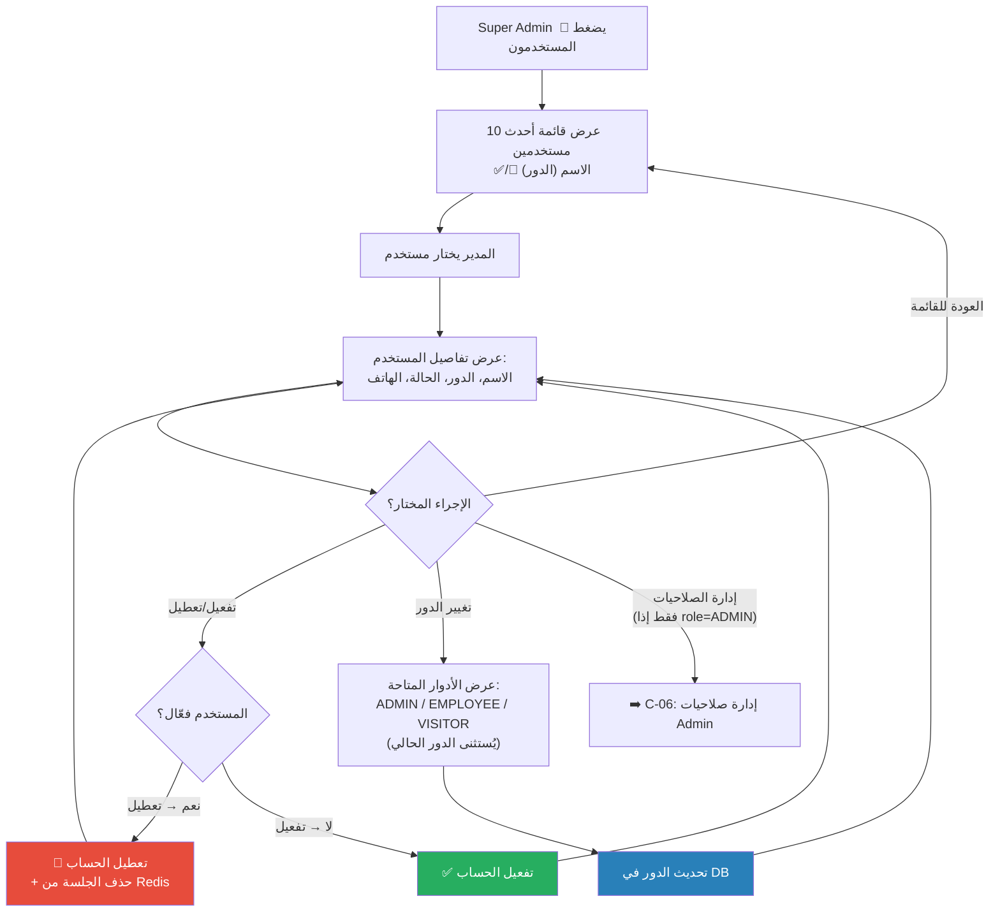

# C-05: إدارة المستخدمين (User Management)

> **الملف المصدري:** `packages/core/src/bot/handlers/users.ts`
> **الحالة:** ✅ مُنفذ | **متاح لـ:** SUPER_ADMIN

## شجرة التدفق

## جدول الإجراءات

| الإجراء | Callback Data | التأثير | مفتاح i18n |
|---------|--------------|--------|-----------|
| عرض مستخدم | `user:view:{telegramId}` | عرض التفاصيل + أزرار الإجراءات | `user-details` |
| تفعيل/تعطيل | `user:toggle:{telegramId}` | قلب `isActive` + حذف session إذا تعطيل | `user-status-updated` |
| تغيير الدور | `user:role:{telegramId}:{role}` | تحديث `role` في DB | `user-role-updated` |
| إدارة الصلاحيات | `user:scopes:{telegramId}` | عرض شاشة الصلاحيات | — |
| العودة | `users:list` | عرض قائمة المستخدمين | `users-list-title` |

## الحالات الاستثنائية

- **قائمة فارغة**: إذا لم يكن هناك مستخدمين → `users-list-empty`
- **مستخدم غير موجود**: إذا تم حذف المستخدم أثناء التصفح → `errors-user-not-found`
- **تعطيل مستخدم**: يتم حذف جلسة Redis فوراً (`session:{telegramId}`)، مما يمنع المستخدم من أي تفاعل حتى يُعاد تفعيله.
- **تغيير الدور لـ VISITOR**: لا يتم حذف الصلاحيات تلقائياً (يجب إزالتها يدوياً من AdminScope إذا كان ADMIN سابقاً).
