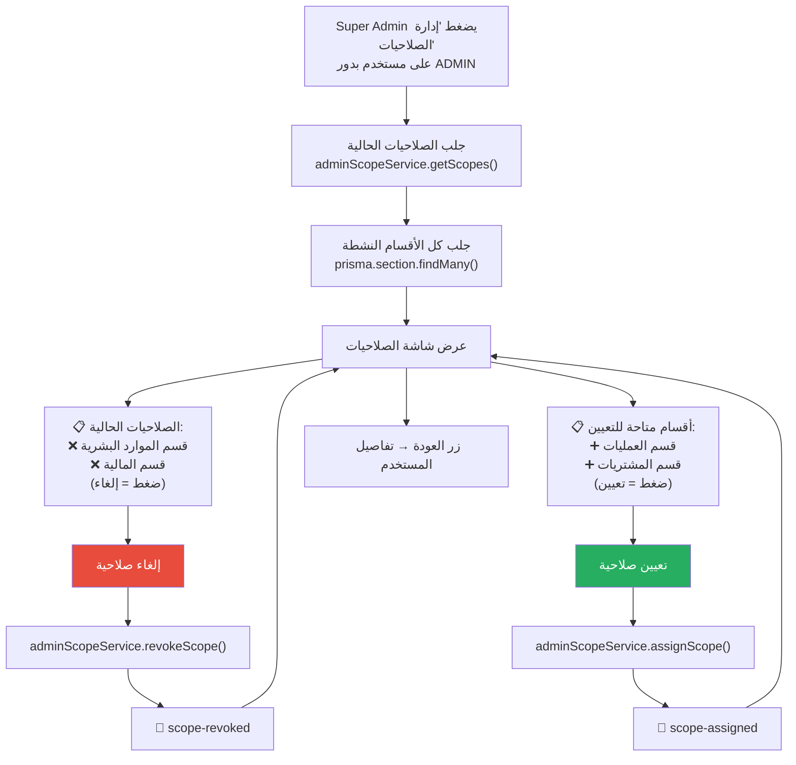

# C-06: إدارة صلاحيات Admin (Admin Scopes)

> **الملف المصدري:** `packages/core/src/bot/handlers/users.ts` → `showUserScopes()`
> **الحالة:** ✅ مُنفذ | **متاح لـ:** SUPER_ADMIN

## شجرة التدفق

## جدول الإجراءات

| الإجراء | Callback Data | التأثير |
|---------|--------------|--------|
| تعيين صلاحية قسم | `user:scope_assign:{telegramId}:{sectionId}` | إضافة سجل AdminScope |
| إلغاء صلاحية قسم | `user:scope_revoke:{telegramId}:{sectionId}` | حذف سجل AdminScope |
| العودة | `user:view:{telegramId}` | شاشة تفاصيل المستخدم |

## القواعد

- **فقط SUPER_ADMIN** يمكنه تعيين/إلغاء الصلاحيات.
- **فقط مستخدمي ADMIN** يظهر لهم زر "إدارة الصلاحيات" (يُخفى للأدوار الأخرى).
- **الصلاحيات على مستوى القسم فقط** حالياً (`moduleId = null`).
- **Unique Constraint**: لا يمكن تعيين نفس القسم مرتين لنفس المستخدم (`userId_sectionId_moduleId`).
- **لا يوجد حذف تلقائي**: عند تغيير دور Admin إلى دور آخر، الصلاحيات تبقى في DB (لكن لا تؤثر لأن RBAC يتحقق من الدور أولاً).
