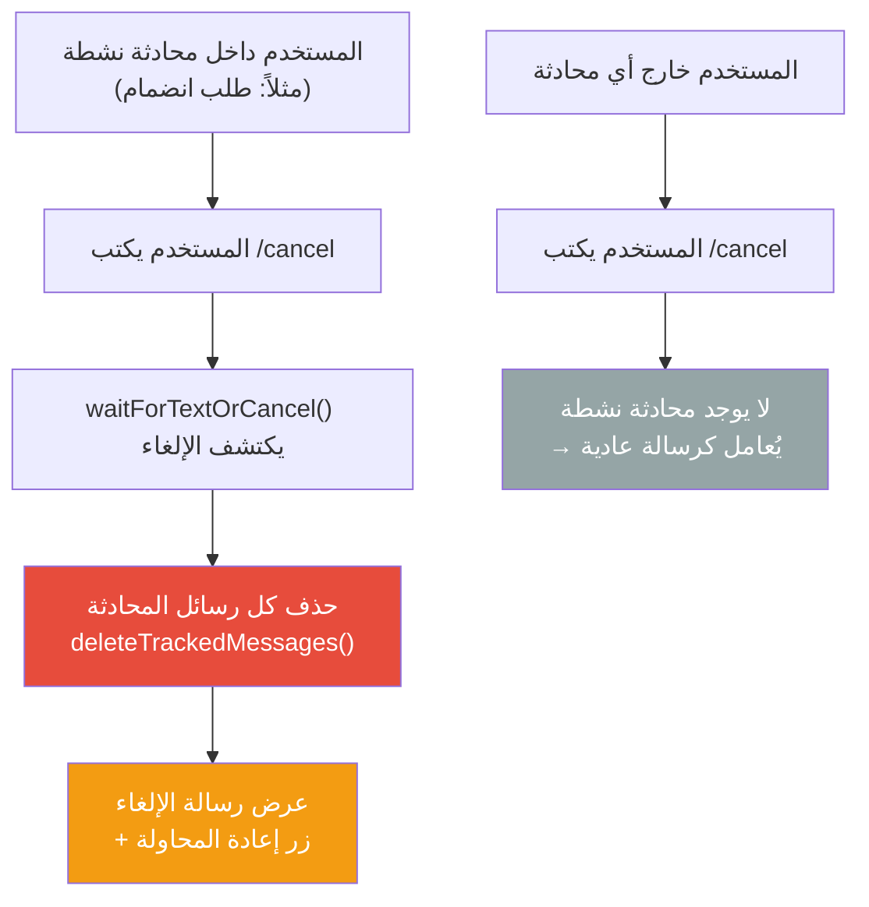

# C-07: إلغاء العمليات (`/cancel`)

> **الملف المصدري:** `packages/core/src/bot/utils/conversation.ts`
> **الحالة:** ✅ مُنفذ

## شجرة التدفق

## جدول الخطوات

| # | السياق | فعل المستخدم | استجابة البوت | مفتاح i18n |
|---|--------|-------------|-------------|-----------|
| 1 | داخل محادثة الانضمام | `/cancel` | حذف الرسائل + عرض "تم الإلغاء" + زر "إعادة التقديم" | `join-cancelled` |
| 2 | داخل محادثة موديول | `/cancel` | حذف الرسائل + حفظ المسودة في Redis | يعتمد على الموديول |
| 3 | خارج أي محادثة | `/cancel` | لا تأثير — يُعامل كنص عادي | — |

## آلية تتبع الرسائل

- كل محادثة تُنشئ `MessageTracker` عند البدء.
- كل رسالة يرسلها البوت أو المستخدم أثناء المحادثة يُسجّل `message_id` الخاص بها.
- عند الإلغاء أو الإكمال: `deleteTrackedMessages()` يحذف كل الرسائل المُسجّلة.
- **النتيجة**: الشات يبقى نظيفاً بدون رسائل المحادثة القديمة.
