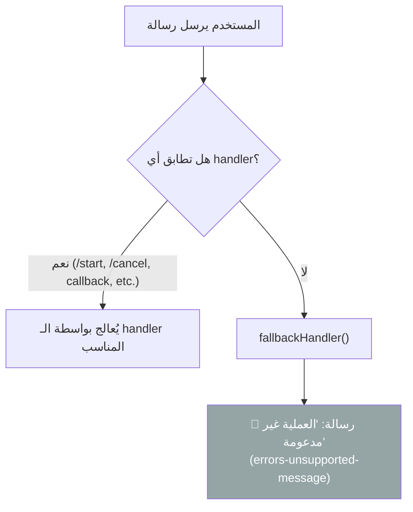

# C-08: الرسائل غير المدعومة (Fallback)

> **الملف المصدري:** `packages/core/src/bot/handlers/fallback.ts`
> **الحالة:** ✅ مُنفذ

## شجرة التدفق

## أمثلة على الرسائل التي تصل للـ Fallback

| نوع الرسالة | مثال | السبب |
|------------|------|-------|
| نص عشوائي | "مرحبا" | ليس أمر معروف |
| صورة بدون سياق | إرسال صورة | لا يوجد handler للصور حالياً |
| ملصق (Sticker) | إرسال ملصق | غير مدعوم |
| أمر غير موجود | `/settings` | لم يُسجّل كأمر |
