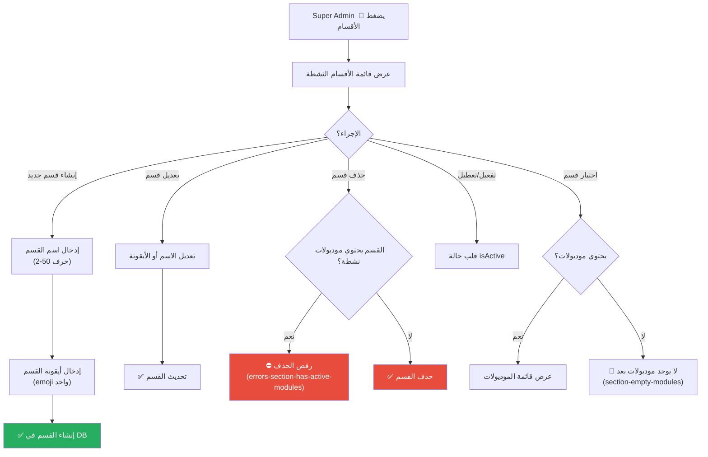

# C-09: إدارة الأقسام (Section Management)

> **الحالة:** ⏳ غير مُنفذ (T035–T040)
> **متاح لـ:** SUPER_ADMIN

## شجرة التدفق المخططة

## القواعد المحددة في المواصفات (FR-018)

| القاعدة | التفاصيل |
|---------|---------|
| اسم القسم | 2–50 حرف (Zod validation) |
| أيقونة القسم | emoji واحد فقط — regex: `/^\p{Emoji}$/u` |
| الحذف | مسموح فقط إذا 0 موديولات نشطة |
| التعطيل | يُخفي القسم من القوائم لكن لا يحذفه |
