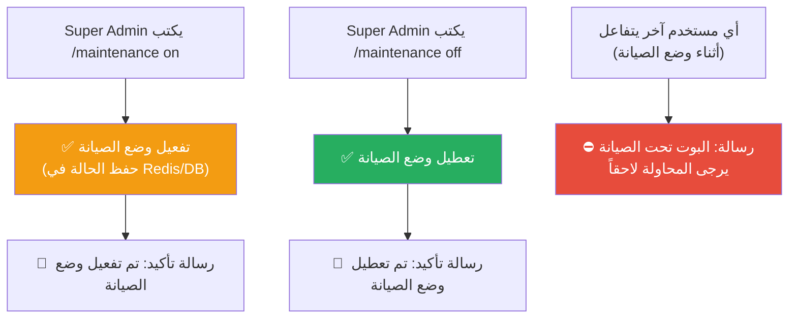

# C-10: وضع الصيانة (Maintenance Mode)

> **الحالة:** ⏳ غير مُنفذ بالكامل (الأمر مُسجّل في RBAC لكن بدون handler)
> **متاح لـ:** SUPER_ADMIN

## شجرة التدفق المخططة

## السلوك المتوقع

| الحالة | من يتأثر | السلوك |
|--------|---------|--------|
| الصيانة مُفعّلة | كل المستخدمين ما عدا SUPER_ADMIN | رسالة صيانة + منع كل التفاعلات |
| الصيانة مُفعّلة | SUPER_ADMIN | يعمل بشكل طبيعي |
| الصيانة مُعطّلة | الكل | عمل طبيعي |

## الوضع الحالي في الكود

- أمر `/maintenance` مُسجّل في `rbac.ts` middleware كأمر `superAdminOnly`.
- لا يوجد `maintenance.ts` handler بعد.
- لا يوجد middleware يتحقق من حالة الصيانة قبل معالجة الطلبات.
