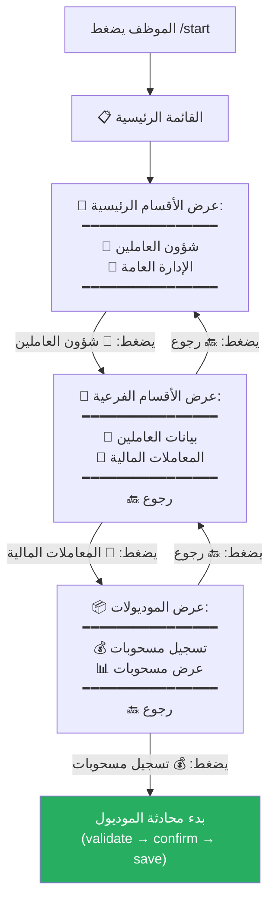
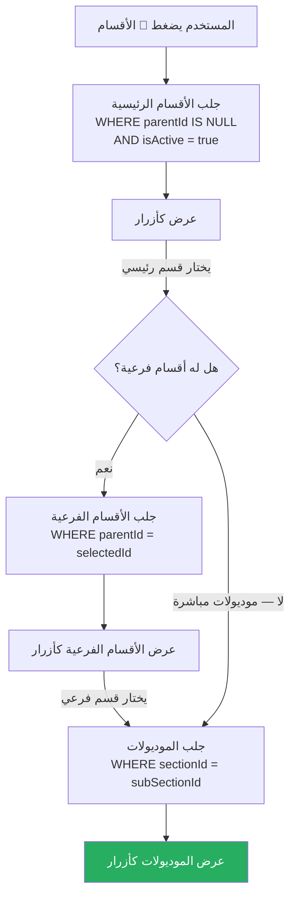
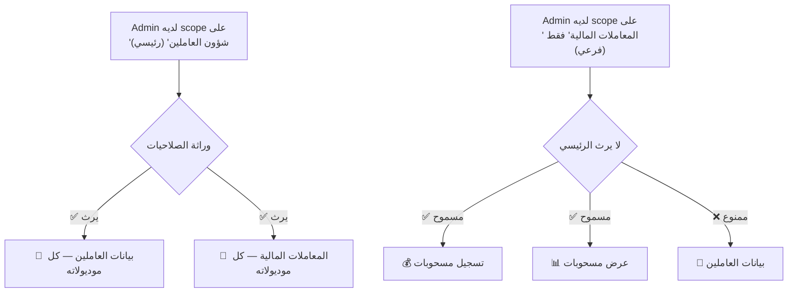

# C-11: التنقل في الأقسام الفرعية (Sub-Section Navigation)

> **الحالة:** ⏳ مقترح (يحتاج تعديل schema + الـ menu handler)

## الهيكل المطلوب

```
📁 شؤون العاملين                         ← قسم رئيسي (parentId = null)
│
├── 📂 بيانات العاملين                    ← قسم فرعي (parentId = "شؤون العاملين")
│    ├── 📝 تسجيل بيانات العاملين          ← موديول
│    ├── 📋 عرض العاملين الحاليين          ← موديول
│    └── 📦 عرض العاملين السابقين          ← موديول
│
└── 📂 المعاملات المالية                  ← قسم فرعي (parentId = "شؤون العاملين")
     ├── 💰 تسجيل مسحوبات                 ← موديول
     └── 📊 عرض مسحوبات                   ← موديول

📁 الإدارة العامة                        ← قسم رئيسي آخر
│
├── 📂 المركبات
│    ├── ⛽ تسجيل الوقود
│    └── 🔧 صيانة
│
└── 📂 المستودعات
     └── 📦 جرد
```

---

## سيناريو التنقل: الموظف يسجّل مسحوبة



## المسار الكامل (3 ضغطات للوصول للموديول)

| الضغطة | ما يظهر | زر الرجوع |
|--------|---------|----------|
| **1** | الأقسام الرئيسية (📁 شؤون العاملين، 📁 الإدارة العامة) | — |
| **2** | الأقسام الفرعية (📂 بيانات العاملين، 📂 المعاملات المالية) | 🔙 رجوع للأقسام الرئيسية |
| **3** | الموديولات (💰 تسجيل مسحوبات، 📊 عرض مسحوبات) | 🔙 رجوع للأقسام الفرعية |
| **4** | بدء المحادثة | /cancel للإلغاء |

---

## ماذا يحتاج التعديل في الكود

### 1. قاعدة البيانات (Prisma Schema)

```prisma
model Section {
  id        String    @id @default(uuid())
  name      String
  slug      String    @unique
  icon      String    @default("📁")
  isActive  Boolean   @default(true)
  orderIndex Int      @default(0)

  // ✨ الجديد: دعم التداخل
  parentId  String?   @map("parent_id")
  parent    Section?  @relation("SubSections", fields: [parentId], references: [id])
  children  Section[] @relation("SubSections")

  // العلاقات الحالية
  modules     Module[]
  adminScopes AdminScope[]
  createdBy   BigInt       @map("created_by")
  creator     User         @relation(fields: [createdBy], references: [telegramId])
  createdAt   DateTime     @default(now())
}
```

### 2. منطق القائمة (menu.ts)



### 3. الـ Session (تتبع التنقل)

```typescript
// في Redis session
{
  currentMenu: ['sections', 'شؤون-العاملين', 'المعاملات-المالية']
  //             المستوى 1    القسم الرئيسي      القسم الفرعي
}
```

---

## صلاحيات RBAC مع الأقسام الفرعية



| الصلاحية | التأثير |
|----------|--------|
| Scope على **قسم رئيسي** | يشمل **كل** الأقسام الفرعية تلقائياً |
| Scope على **قسم فرعي** | يشمل موديولات هذا الفرعي **فقط** |

---

## القيود

- **مستويين فقط** (رئيسي → فرعي). لا يوجد فرعي من فرعي.
- القسم الرئيسي **لا يحتوي موديولات مباشرة** — الموديولات دائماً تحت قسم فرعي.
- إذا كان القسم صغير ولا يحتاج تقسيم، يمكن أن يكون **رئيسي بدون فرعيات** ويحتوي موديولات مباشرة.
