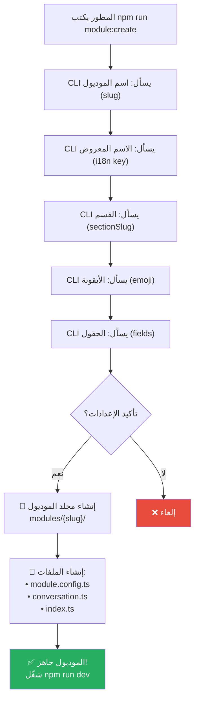

# M-01: إنشاء موديول جديد عبر CLI

> **الأمر:** `npm run module:create`
> **الحالة:** ✅ مُنفذ

## شجرة التدفق



## البنية الناتجة

```
modules/{slug}/
├── module.config.ts    # تعريف الموديول (ModuleConfig)
├── conversation.ts     # مسار المحادثة (الخطوات)
└── index.ts           # نقطة التصدير
```

## أوامر أخرى

| الأمر | الوصف |
|-------|-------|
| `npm run module:list` | عرض كل الموديولات المُعرّفة |
| `npm run module:remove` | حذف موديول (تفاعلي) |
