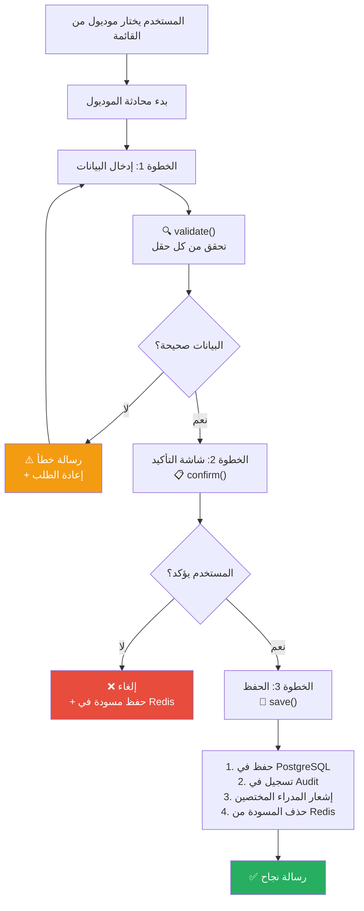

# M-02: دورة حياة الموديول (Module Lifecycle)

> **الملفات:** `packages/module-kit/src/validation.ts`, `confirmation.ts`, `persistence.ts`
> **الحالة:** ✅ مُنفذ

## شجرة التدفق

## المراحل الثلاث

| المرحلة | الوظيفة | المدخلات | المخرجات |
|---------|--------|---------|---------|
| **Validate** | `validate(field, value, rules)` | قيمة الحقل + قواعد التحقق | `{ valid, error? }` |
| **Confirm** | `confirm(ctx, data)` | البيانات المُجمّعة | `boolean` (تأكيد/إلغاء) |
| **Save** | `save(ctx, data, config)` | البيانات المؤكدة + إعدادات الموديول | `SaveResult` |

## PII Masking

- قبل تسجيل البيانات في الـ Audit، يتم تمرير القيم عبر `piiMasker`.
- الحقول المحددة كـ `sensitive: true` في config تُخفى (`***`).
- مثال: رقم الهاتف `01012345678` → `010****5678`
