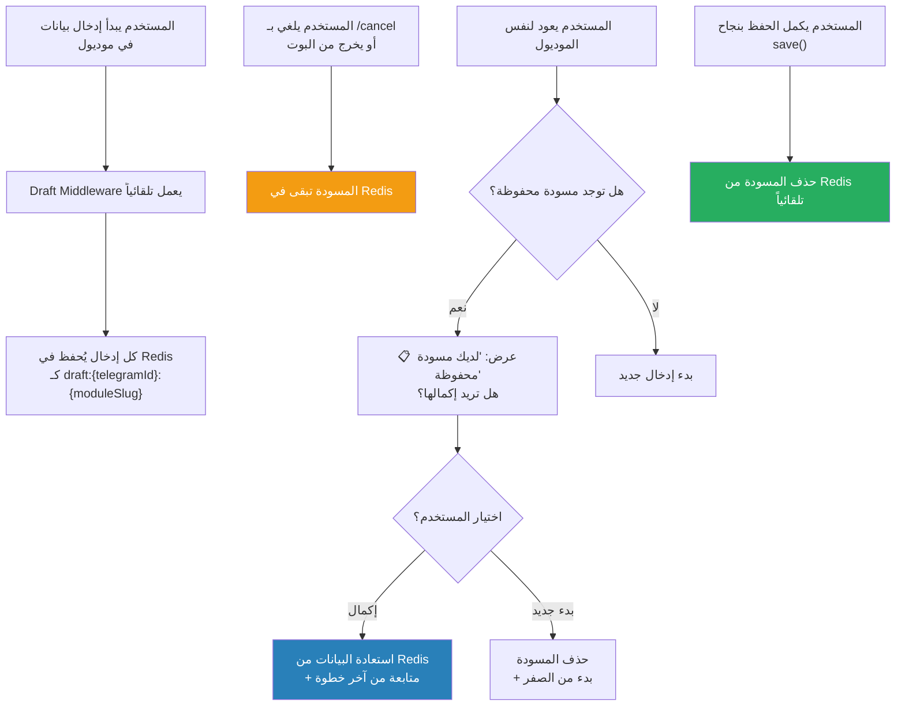

# M-03: نظام المسودات (Draft System)

> **الملف:** `packages/core/src/bot/middleware/draft.ts`
> **الحالة:** ✅ مُنفذ

## شجرة التدفق

## تفاصيل تقنية

| العنصر | التفاصيل |
|--------|---------|
| مفتاح Redis | `draft:{telegramId}:{moduleSlug}` |
| البيانات المحفوظة | `session` كاملة (تشمل `currentModule`, `currentSection`, وبيانات الحقول) |
| موعد الحذف | عند نجاح `save()` أو بدء إدخال جديد |
| TTL | لا يوجد حالياً (BL-003: مخطط إضافة 15 دقيقة timeout) |
