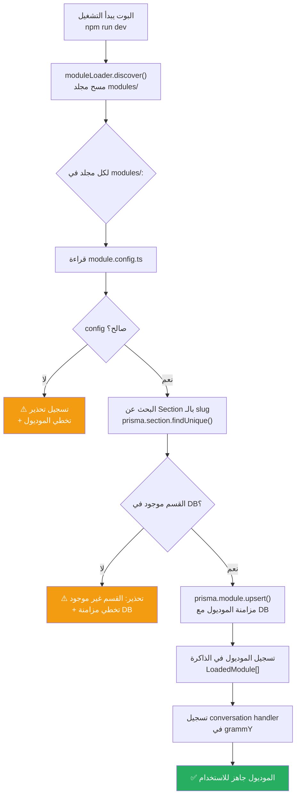

# M-04: تحميل الموديولات تلقائياً (Module Loading)

> **الملف:** `packages/core/src/bot/module-loader.ts`
> **الحالة:** ✅ مُنفذ

## شجرة التدفق



## الشروط المسبقة

1. **القسم (Section) يجب أن يكون موجوداً في DB** — الموديول يشير لـ `sectionSlug` ويحتاج قسم حقيقي للمزامنة.
2. **`module.config.ts` يجب أن يُصدّر `ModuleConfig` صالح** — يتحقق من `slug`, `sectionSlug`, `permissions`, `fields`.

## ما يحدث عند الـ Upsert

```typescript
prisma.module.upsert({
  where: { slug: config.slug },
  create: { slug, name, icon, sectionId, isActive: true },
  update: { name, icon, sectionId },
})
```

- إذا الموديول **جديد**: يُنشأ في DB مع `isActive: true`.
- إذا الموديول **موجود**: يُحدّث الاسم والأيقونة والقسم فقط.
