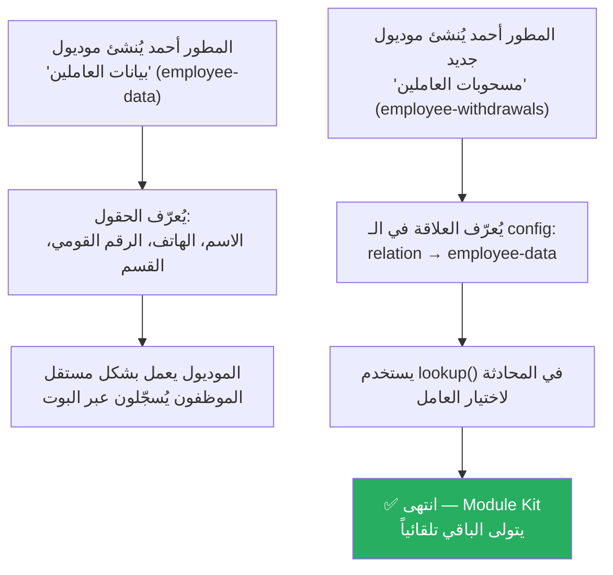
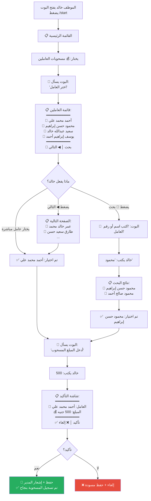
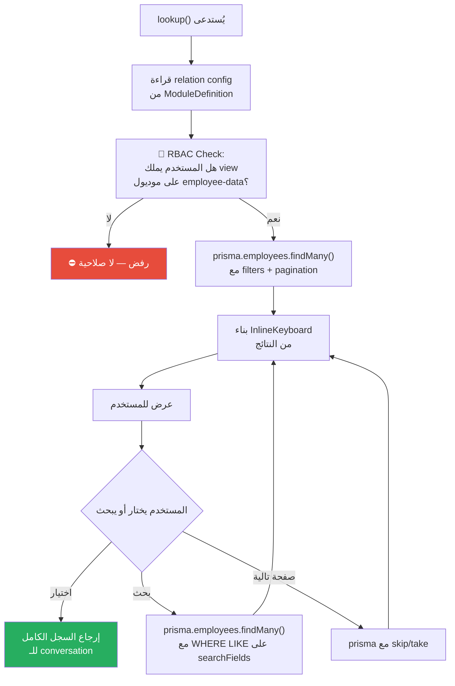

# M-05: ربط الموديولات (Module Relations & Lookup)

> **الحالة:** ⏳ مقترح (لم يُنفذ بعد)

## الفكرة

عندما يحتاج موديول بيانات من موديول آخر (مثلاً: "مسحوبات العاملين" يحتاج اختيار عامل من "بيانات العاملين")، يوفر Module Kit نظام ربط تلقائي يتولى جلب البيانات وعرضها للمستخدم بدون أن يكتب المطور كود UI.

---

## السيناريو الكامل: تسجيل مسحوبات العاملين

### الشخصيات
- **المطور (أحمد)**: يبني الموديولات
- **الموظف (خالد)**: يستخدم البوت لتسجيل مسحوبة

---

### الجزء 1: ما يفعله المطور (مرة واحدة)



#### ما يكتبه المطور في `module.config.ts`:

```typescript
defineModule({
  slug: 'employee-withdrawals',
  sectionSlug: 'hr',
  name: 'module-withdrawals-name',       // مفتاح i18n
  icon: '💰',

  // ✨ تعريف العلاقة
  relations: [
    {
      field: 'employeeId',                // اسم الحقل في هذا الموديول
      targetModule: 'employee-data',       // slug الموديول المصدر
      targetTable: 'employees',            // اسم جدول Prisma
      displayField: 'fullName',            // الحقل الذي يظهر للمستخدم
      searchFields: ['fullName', 'phone'], // حقول البحث
      filters: { isActive: true },         // فقط العاملين النشطين
    }
  ],

  permissions: { /* ... */ },
  addEntryPoint: withdrawalConversation,
})
```

#### ما يكتبه المطور في `conversation.ts`:

```typescript
async function withdrawalConversation(conversation, ctx) {
  // الخطوة 1: اختيار العامل — سطر واحد فقط!
  const employee = await lookup(ctx, conversation, {
    relation: 'employeeId',
    prompt: 'withdrawal-select-employee',  // مفتاح i18n
  })
  // employee = { id: 'abc123', fullName: 'محمد أحمد علي', phone: '01012345678' }

  // الخطوة 2: إدخال المبلغ (validate عادي)
  const amount = await validate(ctx, conversation, { /* ... */ })

  // الخطوة 3: تأكيد + حفظ
  await confirm(ctx, { employeeName: employee.fullName, amount })
  await save(ctx, { /* ... */ })
}
```

---

### الجزء 2: ما يراه المستخدم النهائي (كل مرة)



---

### الجزء 3: ما يحدث خلف الكواليس (Module Kit)



---

## ملخص التجربة

### من منظور المطور ✏️

| بدون Relations API | مع Relations API |
|-------------------|-----------------|
| يكتب query يدوي في Prisma | سطر واحد: `lookup()` |
| يبني InlineKeyboard يدوياً | تلقائي |
| يكتب منطق البحث والصفحات يدوي | تلقائي |
| يتحقق من RBAC يدوي | تلقائي |
| **~80 سطر كود** | **~3 أسطر كود** |

### من منظور المستخدم النهائي 👤

| الخطوة | ما يراه |
|--------|---------|
| 1 | قائمة أسماء العاملين (أزرار) |
| 2 | إمكانية البحث بالاسم أو الرقم |
| 3 | إمكانية التنقل بين الصفحات |
| 4 | بعد الاختيار → يكمل بقية الحقول بشكل عادي |

### من منظور النظام ⚙️

| العنصر | التفاصيل |
|--------|---------|
| RBAC | لا يعرض عاملين من أقسام ليس لديه صلاحية عليها |
| Pagination | 5 نتائج في الصفحة (قابل للضبط) |
| Search | بحث نصي في الحقول المحددة في `searchFields` |
| Validation | عند تشغيل البوت: يتحقق أن `targetModule` موجود فعلاً |
| Draft | إذا ألغى المستخدم، الاختيار يُحفظ في المسودة |
