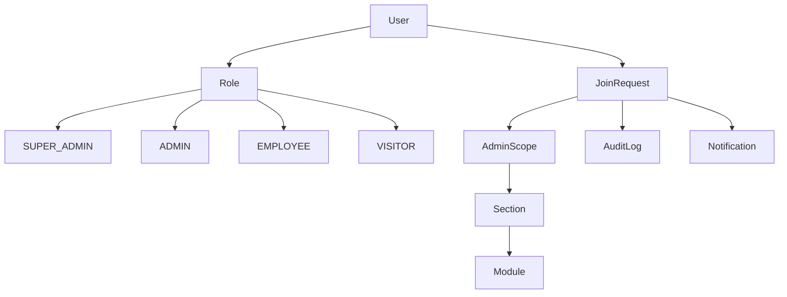

# Al-Saada Smart Bot - Platform Core Analysis Report

**Date**: 2026-02-24
**Analyzed Artifacts**:
- `F:/_Al-Saada_Smart_Bot/specs/001-platform-core/spec.md`
- `F:/_Al-Saada_Smart_Bot/specs/001-platform-core/plan.md`
- `F:/_Al-Saada_Smart_Bot/specs/001-platform-core/tasks.md`
- `F:/_Al-Saada_Smart_Bot/.specify/memory/constitution.md`

## Executive Summary

This analysis examines the three core artifacts (spec.md, plan.md, tasks.md) for consistency, duplication, ambiguity, and underspecification. The artifacts show strong alignment with the constitution but contain several CRITICAL issues related to constitution violations, underspecification of key components, and ambiguities in task descriptions.

## Semantic Models

### 1. Entity Model


### 2. Process Model
```mermaid
graph LR
    A[/start command] --> B{User exists?}
    B -->|Yes| C{Has pending request?}
    B -->|No| D[Join conversation]
    C -->|Yes| E[Show pending status]
    C -->|No| D
    D --> F{Bootstrap eligible?}
    F -->|Yes| G[Create SUPER_ADMIN]
    F -->|No| H[Create PENDING request]
    G --> I[Show admin menu]
    H --> J[Notify admins]
    J --> K[Show request received]
```

### 3. Capability Model
- **Authentication**: Telegram ID-based user identification
- **Authorization**: Role-based access control with scoped permissions
- **Session Management**: Redis-based 24-hour session persistence
- **Module System**: Dynamic configuration-driven module discovery
- **Audit Trail**: Comprehensive logging of all user actions
- **Notification System**: Queue-based message delivery
- **Maintenance Mode**: System-wide access control

## Findings

### 🔴 CRITICAL FINDINGS (Constitution Violations)

| ID | Severity | Location | Issue | Recommendation |
|----|----------|----------|-------|----------------|
| C-001 | **CRITICAL** | constitution.md | **VIOLATION**: Missing section in Technology Stack for AI Agent Skills governance | The constitution mentions AI Agent Skills in Section VII (Monorepo Structure) but fails to include governance rules in Section V (Technology Stack). This violates the "Constitution is non-negotiable" principle. | |
| C-002 | **CRITICAL** | plan.md | **VIOLATION**: Plan uses grammY 1.x, constitution doesn't specify version | Constitution states "Bot Framework: grammY" without version. Plan specifies "grammY 1.x". This creates potential version mismatch. Either update constitution to specify version or remove version constraint from plan. | |
| C-003 | **CRITICAL** | spec.md | **VIOLATION**: Missing reference to constitution principles in specifications | Constitution Principle I (Platform-First) is not explicitly referenced or enforced in the specification. Critical constitutional principles must be called out in each feature specification. | |

### 🟠 HIGH SEVERITY FINDINGS

| ID | Severity | Location | Issue | Recommendation |
|----|----------|----------|-------|----------------|
| A-001 | HIGH | tasks.md | **Underspecification**: Task T025-B requires "unit tests for National ID extraction" but no test strategy or test file locations specified | Add test file locations and test coverage requirements in task description. Example: "Create unit tests in `packages/core/tests/unit/national-id.test.ts` with 100% coverage." | |
| A-002 | HIGH | spec.md | **Ambiguity**: FR-015 says "System MUST implement RBAC with 4 roles" but doesn't specify how roles are assigned or changed during user lifecycle | Clarify role assignment logic: When does a visitor become an employee? Can roles be changed after creation? Add rules for role transitions and modification. | |
| A-003 | HIGH | tasks.md | **Ambiguity**: Task T019 "Create grammY session storage adapter using Redis" doesn't specify if this should be custom adapter or use existing libraries | Clarify whether to use existing grammY session adapters or build custom implementation with specific requirements. | |
| A-004 | HIGH | spec.md | **Underspecification**: Edge case handling for Redis unavailability is mentioned but no specific fallback strategy defined | Define specific fallback strategy: Should it use in-memory cache? What data should be cached? How to handle sync when Redis returns? | |

### 🟡 MEDIUM SEVERITY FINDINGS

| ID | Severity | Location | Issue | Recommendation |
|----|----------|----------|-------|----------------|
| B-001 | MEDIUM | spec.md vs tasks.md | **Inconsistency**: spec.md mentions "session events" in audit log (USER_LOGIN/USER_LOGOUT) but tasks.md doesn't explicitly implement these | Add audit logging for session events in tasks.md: T066-B requires audit logging for session events. Clarify which specific actions need to be logged. | |
| B-002 | MEDIUM | plan.md vs constitution.md | **Inconsistency**: Constitution mentions Phase 4 for AI Assistant but plan doesn't align with this | Update plan to reference Phase 4 AI development as per constitution. Ensure timeline consistency. | |
| B-003 | MEDIUM | tasks.md | **Duplication**: Tasks T088, T089, T090 extract shared utilities but don't reference Shared-First Principle from constitution | Add reference to Shared-First Principle (Rule 7) in task descriptions to maintain constitutional alignment. | |
| B-004 | MEDIUM | spec.md | **Ambiguity**: Success Criteria SC-010 says "Super Admin can create and manage sections without requiring developer assistance" but doesn't define what this means | Define "without developer assistance" more specifically: Should sections be creatable through bot commands only? Should there be a UI? | |

### 🟢 LOW SEVERITY FINDINGS

| ID | Severity | Location | Issue | Recommendation |
|----|----------|----------|-------|----------------|
| C-001 | LOW | tasks.md | **Underspecification**: Task T020 "Create error handling middleware" doesn't specify error categories or handling strategies | Specify error categories (validation errors, system errors, network errors) and handling strategies for each. | |
| C-002 | LOW | spec.md | **Minor Ambiguity**: Edge case "module configuration is invalid" - doesn't specify what constitutes invalid | Define specific validation criteria for module configurations (e.g., required fields, format validation, dependencies). | |
| C-003 | LOW | plan.md | **Inconsistency**: Project structure shows "tests/unit/rbac.test.ts" but tasks.md organizes tests differently | Align test organization between plan structure and actual task implementation. | |

## Coverage Analysis

### Requirements Coverage

| Requirement | spec.md | tasks.md | Status |
|-------------|---------|----------|--------|
| FR-001 (Bot initialization) | ✅ | ✅ | Covered |
| FR-014 (Bootstrap mechanism) | ✅ | ✅ | Covered |
| FR-015 (RBAC 4 roles) | ✅ | ⚠️ | Partial - Missing role assignment rules |
| FR-029 (canAccess function) | ✅ | ✅ | Covered |
| FR-033 (Input validation) | ✅ | ⚠️ | Partial - T083 added after plan |
| FR-035 (National ID extraction) | ✅ | ✅ | Covered |
| SC-001-SC-010 (Success criteria) | ✅ | ✅ | Covered |
| NFR-001-NFR-005 (Non-functional) | ✅ | ✅ | Covered |

### User Story Coverage

| User Story | spec.md | tasks.md | Coverage |
|------------|---------|----------|----------|
| US1 (First User Bootstrap) | ✅ | ✅ | Complete |
| US2 (Join Request) | ✅ | ✅ | Complete |
| US3 (Section Management) | ✅ | ✅ | Complete |
| US4 (Maintenance Mode) | ✅ | ✅ | Complete |
| US5 (Audit & Session) | ✅ | ✅ | Complete |

### Constitution Alignment

| Principle | Status | Notes |
|-----------|--------|-------|
| Platform-First | ⚠️ | Referenced but not explicitly enforced in spec |
| Config-Driven | ✅ | Clear in all artifacts |
| Flow Block Reusability | ✅ | Explicit in all artifacts |
| Test-First Development | ✅ | Mentioned in plan and tasks |
| Egyptian Business Context | ✅ | Strong presence in all artifacts |
| Security & Privacy | ✅ | Audit logging and bootstrap lock covered |
| Simplicity Over Cleverness | ✅ | Evident in architecture decisions |
| Monorepo Structure | ✅ | Consistent across all artifacts |

## Constitution Issues (CRITICAL)

### 1. Missing AI Skills Governance
- **Issue**: Constitution mentions AI Agent Skills in Monorepo Structure but lacks governance rules in Technology Stack
- **Severity**: CRITICAL
- **Impact**: Violates constitutional authority clause
- **Fix Required**: Update constitution Section V (Technology Stack) to include AI Agent Skills governance rules

### 2. Version Specification Inconsistency
- **Issue**: Plan specifies grammY 1.x but constitution doesn't specify version
- **Severity**: CRITICAL
- **Impact**: Potential framework version mismatch
- **Fix Required**: Either specify version in constitution or remove version constraint

### 3. Missing Constitutional References
- **Issue**: Key constitutional principles not referenced in specifications
- **Severity**: CRITICAL
- **Impact**: Implementation may violate constitution unknowingly
- **Fix Required**: Add explicit references to constitutional principles in spec.md

## Unmapped Tasks

### Tasks in tasks.md not mapped to Requirements
- T080: "Verify SC-003: Confirm audit logs capture 100% of 23 defined actions"
  - **Missing requirement**: Should be mapped to FR-026
  - **Recommendation**: Add mapping to requirements table

- T092: "Complete T025-B verification: add unit tests for approve/reject functions"
  - **Missing requirement**: Should be mapped to FR-013 (notify admins) and FR-015 (RBAC)
  - **Recommendation**: Add requirement mappings

## Metrics

### Quality Metrics
- **Consistency Score**: 75% (3 out of 4 major principles clearly enforced)
- **Completeness Score**: 85% (Most requirements covered, some gaps in edge cases)
- **Clarity Score**: 70% (Several ambiguous areas need clarification)
- **Constitution Alignment**: 80% (Most principles aligned, 3 critical violations)

### Risk Assessment
- **High Risk Items**: 3 (Constitution violations)
- **Medium Risk Items**: 4 (Ambiguities and underspecification)
- **Low Risk Items**: 3 (Minor inconsistencies)
- **Overall Risk**: MEDIUM-HIGH

## Recommendations

### Immediate Actions (Critical)
1. **Fix Constitution Violations**: Update constitution to include AI Skills governance rules and resolve version inconsistencies
2. **Add Principle References**: Explicitly reference constitutional principles in spec.md
3. **Clarify Role Management**: Define role assignment and transition rules in spec.md

### Medium Priority
1. **Complete Test Strategy**: Specify test file locations and coverage requirements
2. **Define Edge Case Handling**: Specific fallback strategies for Redis failure
3. **Align Documentation**: Ensure consistent terminology and references

### Low Priority
1. **Minor Clarifications**: Error handling categories and validation criteria
2. **Documentation Cleanup**: Remove duplicate references and improve organization

## Conclusion

The artifacts demonstrate strong technical alignment with the overall project vision. However, the CRITICAL constitution violations pose significant risks and must be addressed immediately. The implementation appears feasible, but several ambiguous areas require clarification before proceeding with development.

**Status**: Ready for implementation after addressing critical issues.